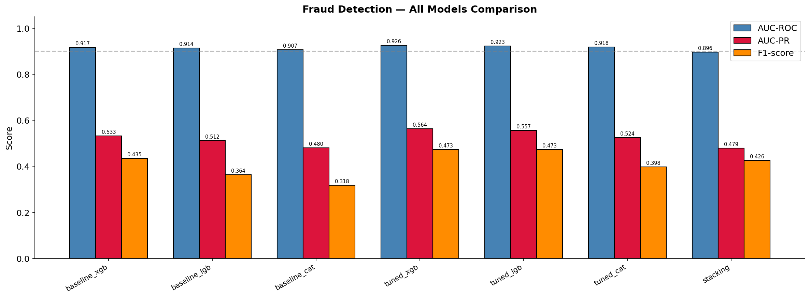
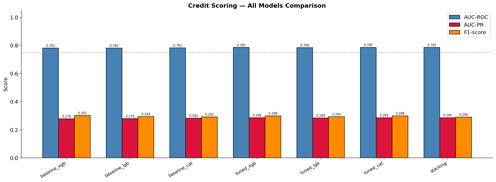

<div align="center">

# 🛡️ FinRiskGuard

### Two production-grade financial risk ML systems built end-to-end —  
### fraud detection & credit default scoring with full explainability

[](https://python.org)
[](https://xgboost.ai)
[](https://lightgbm.readthedocs.io)
[](https://catboost.ai)
[](https://optuna.org)
[](https://shap.readthedocs.io)
[](https://fastapi.tiangolo.com)
[](https://docker.com)
[](https://aws.amazon.com)
[](https://gradio.app)

</div>

---

## The Problem

Financial institutions lose billions annually to fraud and bad loans. Both problems share the same brutal challenge: **extreme class imbalance, noisy high-dimensional data, and zero tolerance for data leakage**.

- A random classifier on fraud data scores AUC-ROC ~0.5 — the minority class is invisible
- D-columns in transaction data drift with time — raw features mislead models trained on historical data  
- 44,143 loan applicants have `DAYS_EMPLOYED = 365,243` — a silent anomaly that corrupts every model that ignores it
- EXT_SOURCE_1 is 65.99% missing — but borrowers missing this score default at **2× the base rate**

Getting these details right is the difference between a model that works in a notebook and one that works in production.

---

## What We Built

| | 🔴 Fraud Detection | 🟠 Credit Scoring |
|---|---|---|
| **Dataset** | IEEE-CIS (Vesta Corp, Kaggle) | Home Credit Default Risk (Kaggle) |
| **Scale** | 590,540 transactions · 434 raw features | 307,511 applicants · 7 tables · 57M+ rows |
| **Imbalance** | 27.6 : 1 (3.50% fraud) | 11.4 : 1 (8.07% default) |
| **Split strategy** | Temporal 80/20 | Stratified 80/20 |
| **Features engineered** | 47 new features | 78 new features |
| **Final features** | 204 | 105 |
| **Models trained** | 7 (baseline · tuned · stacking) | 7 (baseline · tuned · stacking) |
| **Best AUC-ROC** | **0.9258** (tuned XGBoost) | **0.7849** (Stacking Ensemble) |
| **Recall @ threshold** | **70.5%** fraud caught | **71.0%** defaults caught |
| **Inference** | FastAPI · Docker · AWS | FastAPI · Docker · AWS |
| **Demo** | Gradio UI | Gradio UI |

---

## Results

### 🔴 Fraud Detection — Final Leaderboard

| Rank | Model | AUC-ROC | AUC-PR | F1 |
|---|---|---|---|---|
| 🥇 | **tuned\_xgb** | **0.9258** | **0.5637** | 0.4728 |
| 🥈 | tuned\_lgb | 0.9231 | 0.5567 | 0.4734 |
| 🥉 | tuned\_cat | 0.9180 | 0.5244 | 0.3983 |
| 4 | baseline\_xgb | 0.9169 | 0.5326 | 0.4348 |
| 5 | baseline\_lgb | 0.9140 | 0.5124 | 0.3641 |
| 6 | baseline\_cat | 0.9072 | 0.4803 | 0.3178 |
| 7 | stacking | 0.8957 | 0.4791 | 0.4264 |

**Threshold = 0.44** → Recall 70.5% · Precision 31.9% · F1 0.439  
Tuning gain: **+0.0089 AUC-ROC** over baseline (Optuna, 100 trials, ~4 hrs)



---

### 🟠 Credit Scoring — Final Leaderboard

| Rank | Model | AUC-ROC | AUC-PR | F1 |
|---|---|---|---|---|
| 🥇 | **stacking** | **0.7849** | **0.2854** | 0.2896 |
| 🥈 | tuned\_cat | 0.7848 | 0.2852 | 0.2984 |
| 🥉 | tuned\_xgb | 0.7846 | 0.2857 | 0.2987 |
| 4 | tuned\_lgb | 0.7840 | 0.2837 | 0.2926 |
| 5 | baseline\_cat | 0.7822 | 0.2820 | 0.2916 |
| 6 | baseline\_lgb | 0.7816 | 0.2786 | 0.2944 |
| 7 | baseline\_xgb | 0.7814 | 0.2783 | 0.3010 |

**Threshold = 0.50** → Recall 71.0% · Precision 18.2% · F1 0.290  
Tuning gain: **+0.0027 AUC-ROC** over baseline (Optuna, 100 trials × 3 models, ~7 hrs)



---

## Why AUC-PR Matters Here

With 27.6:1 and 11.4:1 imbalance, AUC-ROC alone is misleading. **AUC-PR measures precision-recall tradeoff on the minority class only** — the honest metric for imbalanced financial risk. We report both throughout.

---

## How It Works — The Full Journey

Every step was first explored in a Jupyter notebook, then hardened into production `src/` code, then re-validated. Nothing ships without evidence.

### 🔴 Fraud Detection

| Step | Notebook → Code | Key finding |
|---|---|---|
| [EDA](docs/fraud/01_eda.md) | `01_eda_fraud.ipynb` | Peak fraud 5–9 AM · D-column drift discovered · risky browsers identified |
| [Feature Engineering](docs/fraud/03_feature_engineering.md) | `src/features/ieee_cis/feature_engineer.py` | 47 features · D-normalization · UID fingerprints · email/browser risk |
| [Preprocessing](docs/fraud/04_preprocessing.md) | `src/data/ieee_cis/preprocessor.py` | 15 NaN flags · 12 high-missing cols dropped · OrdinalEncoder |
| [Feature Selection](docs/fraud/05_feature_selection.md) | `src/features/ieee_cis/feature_selector.py` | MI + XGB rank → 204 final · D_normalized force-included |
| [Leakage Audit](docs/fraud/02_leakage.md) | `02_fraud_data_leakage_analysis.ipynb` | Zero FAIL across 6 checks · temporal split verified clean |
| [Modeling](docs/fraud/06_modeling.md) | `src/models/fraud/fraud_detector.py` | Baseline → Optuna 100 trials → Stacking |
| [Model Analysis](docs/fraud/07_model_analysis.md) | `06_fraud_model_analysis.ipynb` | tuned_xgb best · AUC-ROC 0.9258 · threshold 0.44 |
| [SHAP](docs/fraud/08_shap.md) | `07_fraud_shap_analysis.ipynb` | FE features dominate · D_normalized confirmed critical |

### 🟠 Credit Scoring

| Step | Notebook → Code | Key finding |
|---|---|---|
| [EDA](docs/credit/01_eda.md) | `02_eda_credit.ipynb` | DAYS_EMPLOYED anomaly · EXT_SOURCE missing = signal · 27M bureau rows |
| [Preprocessing](docs/credit/03_preprocessing.md) | `src/data/home_credit/preprocessor.py` | 44,143 anomalous rows fixed · threshold 67% to keep EXT_SOURCE_1 |
| [Feature Engineering](docs/credit/04_feature_engineering.md) | `src/features/home_credit/feature_engineer.py` | 78 features · EXT_SOURCE combos · bureau/POS/installment agg · target enc |
| [Feature Selection](docs/credit/05_feature_selection.md) | `src/features/home_credit/feature_selector.py` | MI + XGB union → 105 final |
| [Leakage Audit](docs/credit/02_leakage.md) | `05_credit_data_leakage_analysis.ipynb` | Zero FAIL across 6 checks · default rate delta 0.0000% |
| [Modeling](docs/credit/06_modeling.md) | `src/models/credit/credit_scorer.py` | Baseline → Optuna 100 trials → Stacking |
| [Model Analysis](docs/credit/07_model_analysis.md) | `08_credit_model_analysis.ipynb` | Stacking best · AUC-ROC 0.7849 · threshold 0.50 |
| [SHAP](docs/credit/08_shap.md) | `09_credit_shap_analysis.ipynb` | FE features: 69% of total SHAP contribution vs 31% raw |

---

## Key Engineering Decisions

**Temporal vs Stratified split** — Fraud uses temporal split because IEEE-CIS has strong time structure; random split leaks future behavioral patterns into training. Credit uses stratified split — applicants are independent, default rate preserved exactly at 8.07%.

**Feature Engineering before Preprocessing (Fraud)** — FE must run first because it reads raw string columns (`id_31`, `DeviceType`, `P_emaildomain`) that OrdinalEncoder destroys. Enforced explicitly in `fraud_pipeline.py`.

**D-column normalization** — Raw D columns drift linearly with time. `FE_D{n}_normalized = D{n} - TransactionDT_days` removes drift and makes features client-stable. Correlation filter drops them (corr > 0.95 with raw D columns), so all 14 are force-included post-selection. SHAP confirmed their importance.

**Missing value as signal** — EXT_SOURCE_1 is 65.99% missing, but absent borrowers default at 2× base rate. Drop threshold set to 67% specifically to retain it. Missingness encoded as binary flag before imputation — confirmed top predictor by SHAP.

**Leakage-free artifacts** — Every frequency map, encoder, imputer, and aggregation fitted on train only. Val and test apply saved artifacts. Verified by dedicated leakage audit notebooks before any model is trained.

**Business-driven threshold** — Default 0.50 optimizes accuracy, not business value. We optimize threshold subject to `Recall ≥ 0.70` then maximize F1 — reflecting the asymmetric cost of missing fraud vs. a false alarm.

**Class imbalance** — `scale_pos_weight=28` (fraud) and `scale_pos_weight=11` (credit) for XGBoost. `is_unbalance=True` for LightGBM. `auto_class_weights='Balanced'` for CatBoost. AUC-PR reported as primary business metric.

---

## Deployment

| Service | Stack | Status |
|---|---|---|
| Fraud Detection API | FastAPI + Docker + AWS EC2 | 🚧 In Progress |
| Credit Scoring API | FastAPI + Docker + AWS EC2 | 🚧 In Progress |
| Demo UI — Fraud | Gradio | 🚧 In Progress |
| Demo UI — Credit | Gradio | 🚧 In Progress |

---

## Repository Structure

```
FinRiskGuard/
├── README.md
├── docs/
│   ├── fraud/
│   │   ├── 01_eda.md
│   │   ├── 02_leakage.md
│   │   ├── 03_feature_engineering.md
│   │   ├── 04_preprocessing.md
│   │   ├── 05_feature_selection.md
│   │   ├── 06_modeling.md
│   │   └── 07_shap.md
│   └── credit/
│       ├── 01_eda.md
│       ├── 02_leakage.md
│       ├── 03_preprocessing.md
│       ├── 04_feature_engineering.md
│       ├── 05_feature_selection.md
│       ├── 06_modeling.md
│       └── 07_shap.md
├── notebooks/
│   ├── 01_eda_fraud.ipynb
│   ├── 02_eda_credit.ipynb
│   ├── 02_fraud_data_leakage_analysis.ipynb
│   ├── 05_credit_data_leakage_analysis.ipynb
│   ├── 06_fraud_model_analysis.ipynb
│   ├── 07_fraud_shap_analysis.ipynb
│   ├── 08_credit_model_analysis.ipynb
│   └── 09_credit_shap_analysis.ipynb
├── src/
│   ├── data/
│   │   ├── ieee_cis/         # loader · splitter · preprocessor
│   │   └── home_credit/      # loader · splitter · preprocessor
│   ├── features/
│   │   ├── ieee_cis/         # feature_engineer · feature_selector
│   │   └── home_credit/      # feature_engineer · feature_selector
│   ├── models/
│   │   ├── fraud/            # fraud_detector.py
│   │   └── credit/           # credit_scorer.py
│   ├── explainability/       # shap_explainer.py
│   └── pipelines/            # fraud_pipeline · credit_pipeline
├── api/                      # FastAPI routes & schemas
├── deploy/                   # Docker · AWS
├── outputs/
│   ├── figures/              # all plots
│   ├── models/               # saved .pkl artifacts
│   ├── reports/              # feature selection CSVs
│   └── logs/                 # full run logs
└── data/
    ├── raw/                  # ieee_cis/ · home_credit/
    └── features/             # parquet feature stores
```