# 🟠 Credit Scoring — Exploratory Data Analysis

**Notebook:** `notebooks/02_eda_credit.ipynb`  
**Purpose:** Understand dataset structure, default patterns, and derive all pipeline constants from data.

[← Back to README](../../README.md) | [→ Preprocessing](02_preprocessing.md)

---

## Dataset Overview

| | Value |
|---|---|
| Source | Home Credit Default Risk (Kaggle) |
| Train applicants | 307,511 |
| Raw features | 122 |
| Default count | 24,825 |
| No-default count | 282,686 |
| **Default rate** | **8.07%** |
| **Imbalance** | **11.4 : 1** |
| Test applicants | 48,744 |
| **Supplementary tables** | **6 tables · ~58M rows total** |

| Table | Rows | Columns |
|---|---|---|
| bureau | 1,716,428 | 17 |
| bureau_balance | 27,299,925 | 3 |
| previous_application | 1,670,214 | 37 |
| POS_CASH_balance | 10,001,358 | 8 |
| credit_card_balance | 3,840,312 | 23 |
| installments_payments | 13,605,401 | 8 |

---

## 1. Target Variable & Class Imbalance

**Problem:** 11.4:1 imbalance. A naive classifier predicting "no default" achieves 91.93% accuracy — useless for risk management.

**Decision:** Explicit imbalance handling:
```python
XGBoost  → scale_pos_weight = 11
LightGBM → is_unbalance = True
CatBoost → auto_class_weights = 'Balanced'
```

**Contract type breakdown:**
- Cash loans: **8.4%** default
- Revolving loans: **5.5%** default

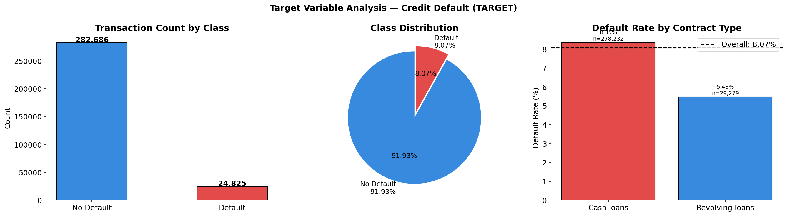

---

## 2. Missing Values

**Problem:** 67 of 122 columns have missing values. Two decisions must be made: what to drop, what to flag.

**Critical finding:** `EXT_SOURCE_1` has **65.99%** missing. If drop threshold is ≤66%, this column gets dropped — but it's one of the strongest predictors. Threshold must be set above 65.99%.

**Decision:** Drop threshold = **67%** (specifically chosen to retain EXT_SOURCE_1):
```
13 columns dropped (>67% missing)
Sample: COMMONAREA_AVG, FLOORSMIN_AVG, LIVINGAPARTMENTS_AVG...
```


### NaN as Signal

Missing values in key columns are non-random — borrowers with missing scores behave differently:

| Column | Missing % | Default (NaN) | Default (has value) | Lift |
|---|---|---|---|---|
| EXT_SOURCE_1 | 65.99% | ~14% | ~7% | **2.0×** |
| OWN_CAR_AGE | 66.35% | ~7% | ~10% | 0.7× |
| EXT_SOURCE_3 | 19.83% | ~12% | ~7% | 1.7× |

**Decision:** Create binary NaN flags **before** imputation:
```python
NAN_FLAG_COLS = [
    'EXT_SOURCE_1',           # 65.99% missing — NaN = missing risk score
    'EXT_SOURCE_2',           # 0.27% missing
    'EXT_SOURCE_3',           # 19.83% missing
    'AMT_GOODS_PRICE',        # 0.09% missing
    'AMT_ANNUITY',            # 0.004% missing
    'OWN_CAR_AGE',            # 66.35% missing
    'DAYS_LAST_PHONE_CHANGE', # 0.001% missing
]
```


---

## 3. Loan Amount Analysis

**Problem:** `AMT_INCOME_TOTAL` has extreme right skewness — log transformation needed.

**Finding:** Credit-to-income and annuity ratios have meaningful correlation with default:
- `FE_credit_income_ratio` — higher credit relative to income → higher default risk
- `FE_annuity_credit_ratio` — payment burden relative to credit amount
- `FE_credit_goods_ratio` — how much credit exceeds goods price

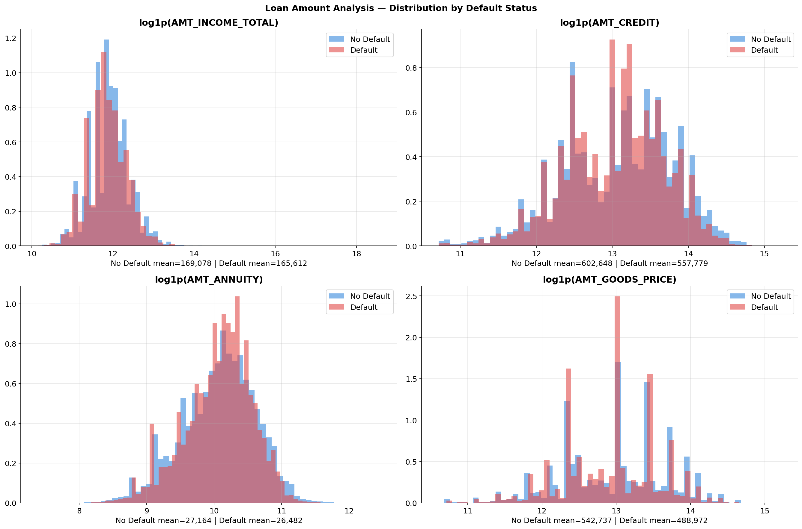
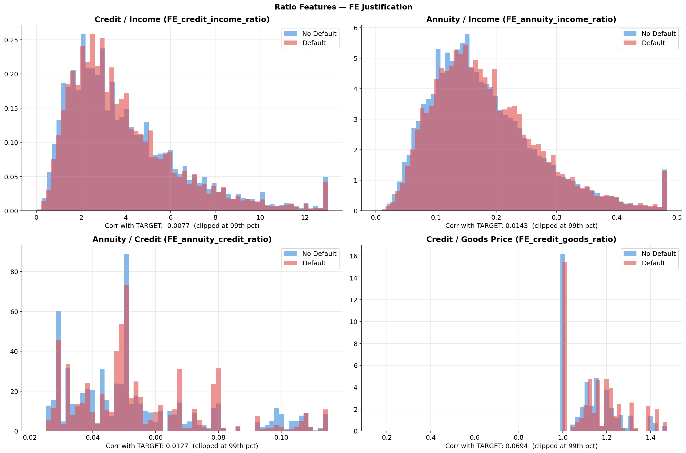
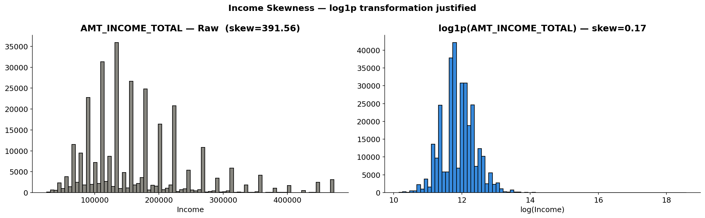

---

## 4. Categorical Features

**Key findings:**

| Feature | Highest default group | Rate |
|---|---|---|
| NAME_INCOME_TYPE | Maternity leave | **~40.0%** |
| NAME_INCOME_TYPE | Unemployed | **~36.0%** |
| NAME_EDUCATION_TYPE | Lower secondary | **10.9%** |
| NAME_HOUSING_TYPE | Rented apartment | **12.3%** |
| NAME_HOUSING_TYPE | With parents | **~11%** |
| CODE_GENDER | Male | **10.1%** vs Female 7.0% |

**Decision:** Frequency encode 6 high-cardinality categoricals:
```python
FREQ_ENCODE_COLS = [
    'ORGANIZATION_TYPE', 'OCCUPATION_TYPE',
    'NAME_INCOME_TYPE', 'NAME_EDUCATION_TYPE',
    'NAME_HOUSING_TYPE', 'NAME_FAMILY_STATUS',
]
```

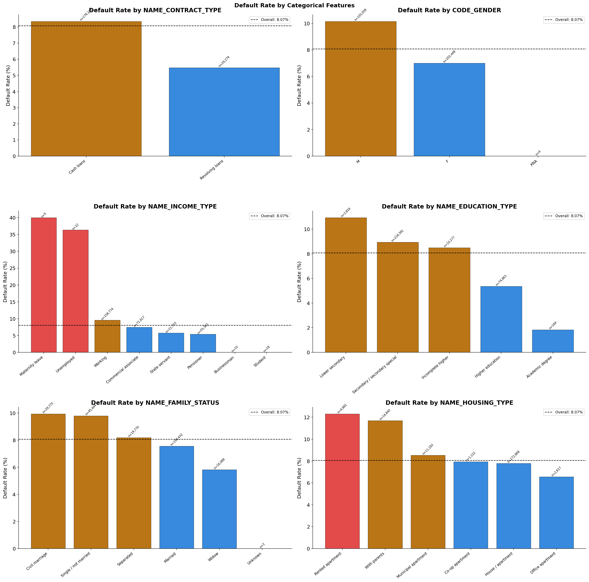
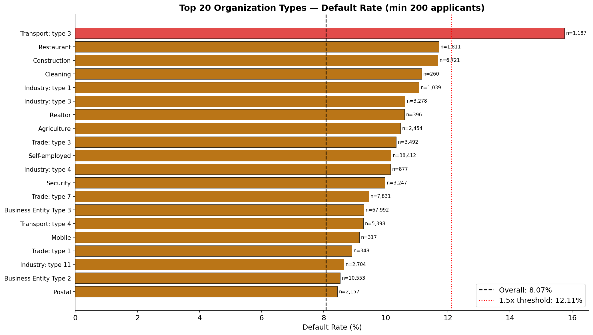
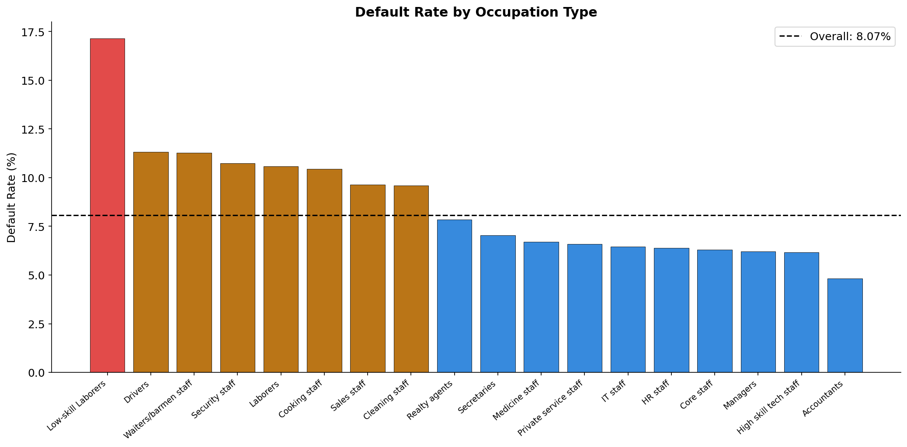

---

## 5. Numerical Features

**Top correlations with TARGET:**
- `EXT_SOURCE_3`: -0.178
- `EXT_SOURCE_2`: -0.160
- `EXT_SOURCE_1`: -0.155
- `DAYS_BIRTH` (age): -0.078
- `DAYS_EMPLOYED`: -0.045

EXT_SOURCE dominates — they are external credit bureau risk scores.

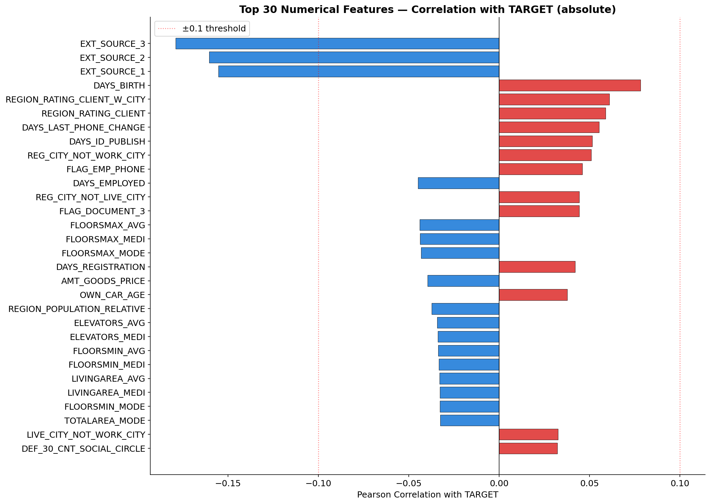
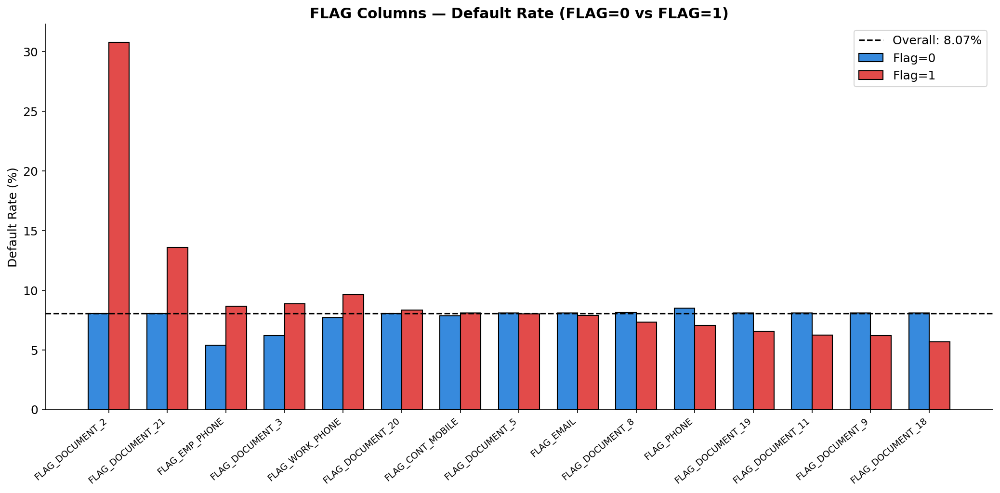

---

## 6. EXT_SOURCE — Primary Risk Signals

**Critical finding:** EXT_SOURCE_1, EXT_SOURCE_2, EXT_SOURCE_3 are the strongest predictors. Defaulters consistently score lower on all three.

**Combination features justify:**
- Mean, min, max, std, sum of all three
- Pairwise products (EXT1×EXT2, EXT2×EXT3, EXT1×EXT3)

These combinations capture non-linear interactions — `FE_ext_mean` became the **#1 most important feature** in the final model.

| Combination | Correlation with TARGET |
|---|---|
| FE_ext_mean | strongest |
| FE_ext23_prod | 2nd strongest |
| FE_ext_min | 3rd |
| FE_ext13_prod | 4th |

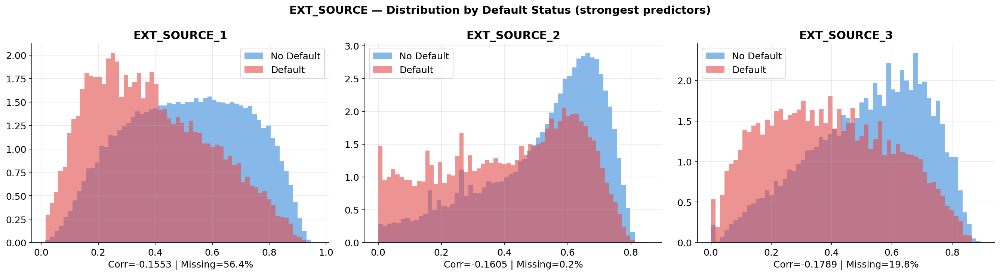
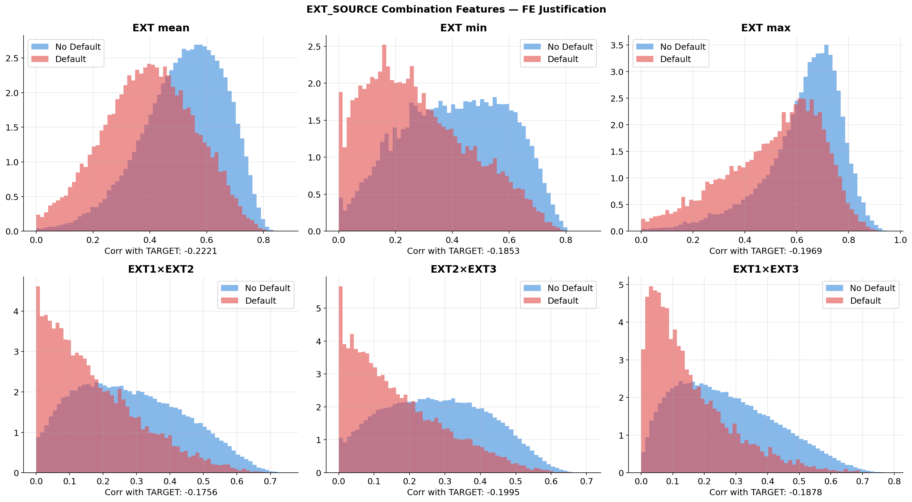
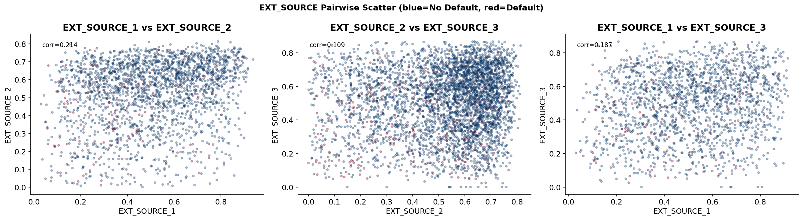

---

## 7. DAYS_EMPLOYED Anomaly

**Problem:** `DAYS_EMPLOYED = 365243` appears in **55,374 rows (18.0%)** — an impossible value (100 years of employment). This is a known data encoding for pensioners/unemployed.

**Impact if ignored:** This single anomaly corrupts every model that treats 365243 as a real numeric value.

```
DAYS_EMPLOYED anomaly analysis:
  Count         : 55,374 rows (18.0%)
  Normal median : -1,648 days
  Default rate (anomaly) : 5.42%
  Default rate (normal)  : 8.65%
```

**Decision:**
```python
DAYS_EMPLOYED_ANOMALY = 365243
# 1. Replace with median of normal values: -1648
# 2. Add binary flag: DAYS_EMPLOYED_ANOM = 1 where anomaly
```

**Age findings:**
- Younger borrowers (20-30) default at higher rates
- `FE_age_years` and `FE_age_group` engineered features justified

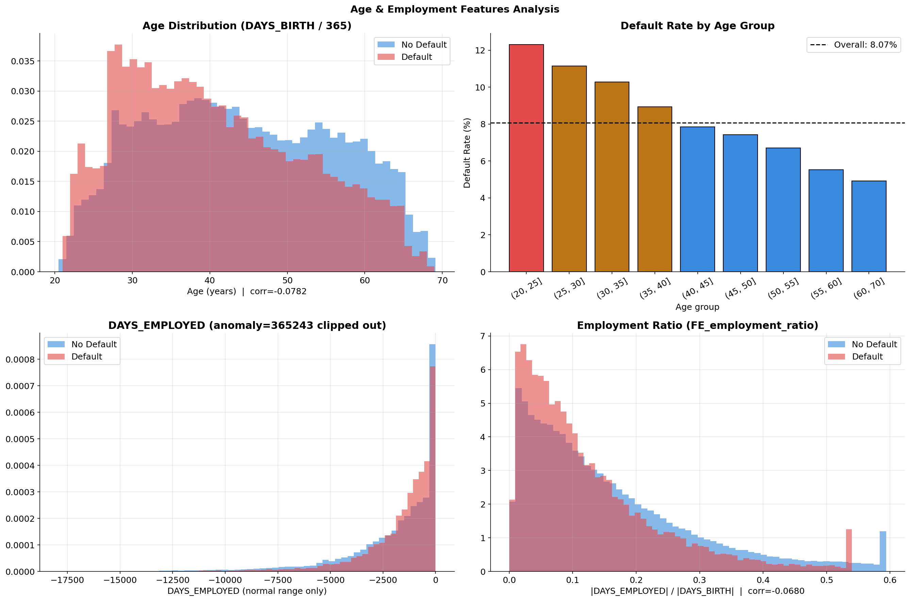


---

## 8. Supplementary Tables — Aggregation Signals

**Key signals discovered from supplementary tables:**

| Signal | Finding |
|---|---|
| Bureau overdue count | Default rate rises sharply: 0 overdue → 8%, 5+ overdue → 25%+ |
| Previous approval rate | Low approval rate (refused often) → higher default |
| Installment late rate | Late payment history → strong default predictor |
| Credit card utilization | High utilization → elevated default |
| Bureau records present | Applicants with NO bureau records default at higher rate |

These findings directly justify the aggregation features in Feature Engineering.

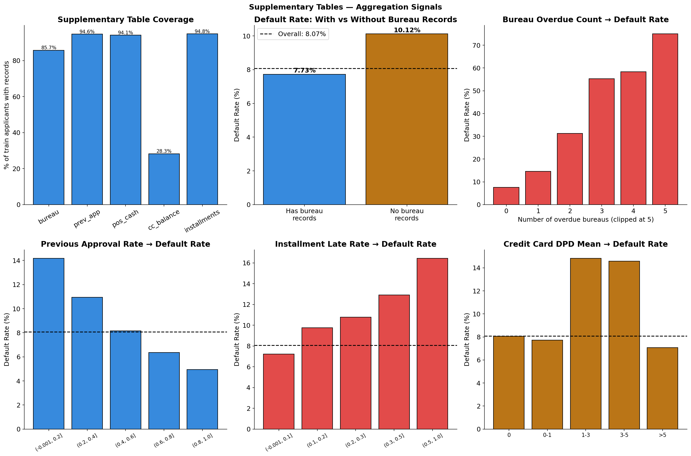

---

## 9. Correlation Analysis

**Finding:** Building feature groups (`_AVG`, `_MODE`, `_MEDI`) are highly correlated with each other — same building measurement in three scales. Correlation filter at 0.95 will drop ~30 of these.

```
Feature pairs with |corr| > 0.95: ~30 pairs
Primary source: AVG/MODE/MEDI building columns
Decision: 0.95 threshold → drops redundant building columns
```

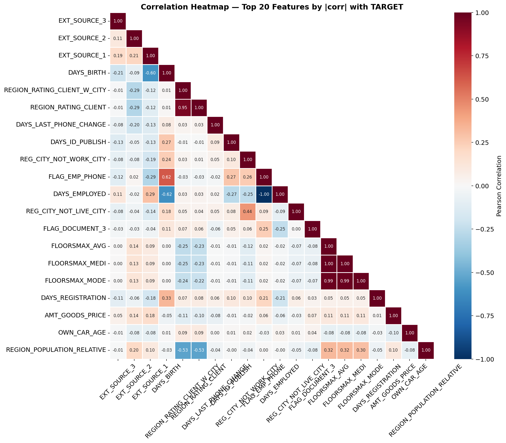
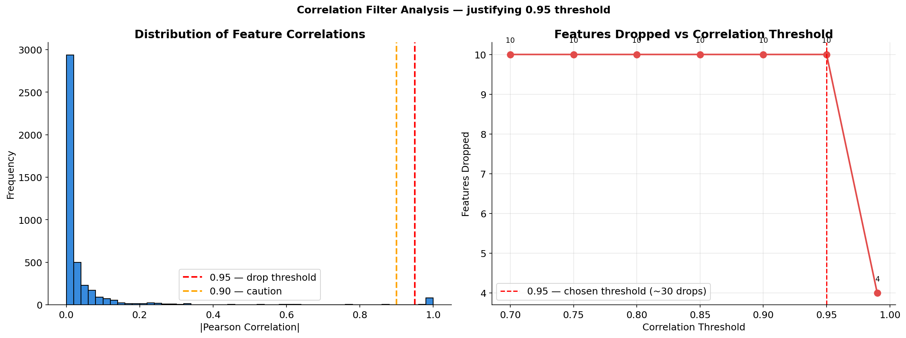

---

## 10. EDA Conclusions — All Pipeline Constants

```python
# Missing value handling
HIGH_MISSING_THRESHOLD = 0.67  # specifically set to retain EXT_SOURCE_1

# DAYS_EMPLOYED anomaly
DAYS_EMPLOYED_ANOMALY = 365243
ANOMALY_MEDIAN        = -1648  # median of normal values

# NaN flags — missingness is signal
NAN_FLAG_COLS = [
    'EXT_SOURCE_1', 'EXT_SOURCE_2', 'EXT_SOURCE_3',
    'AMT_GOODS_PRICE', 'AMT_ANNUITY',
    'OWN_CAR_AGE', 'DAYS_LAST_PHONE_CHANGE',
]

# Frequency encoding candidates
FREQ_ENCODE_COLS = [
    'ORGANIZATION_TYPE', 'OCCUPATION_TYPE',
    'NAME_INCOME_TYPE', 'NAME_EDUCATION_TYPE',
    'NAME_HOUSING_TYPE', 'NAME_FAMILY_STATUS',
]

# Feature selection
CORR_DROP_THRESHOLD = 0.95  # drops ~30 building AVG/MODE/MEDI columns
TOP_K_FEATURES      = 70    # per method (MI + XGB union → ~105 final)

# Imbalance
SCALE_POS_WEIGHT = 11  # XGBoost
```

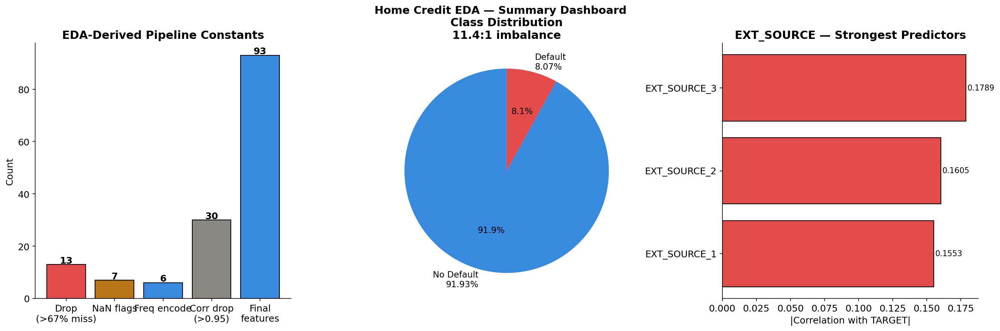

---

[← Back to README](../../README.md) | [→ Preprocessing](02_preprocessing.md)