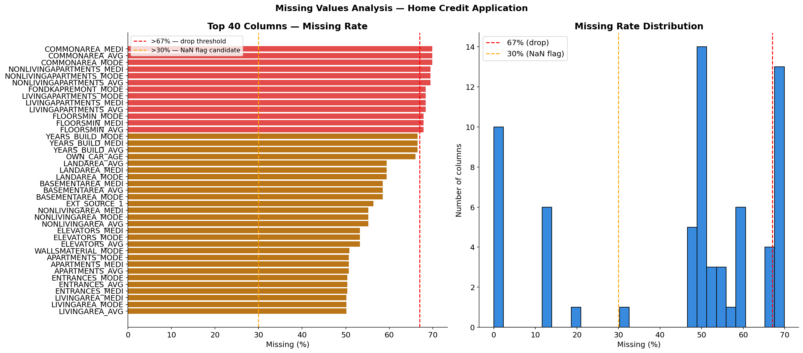
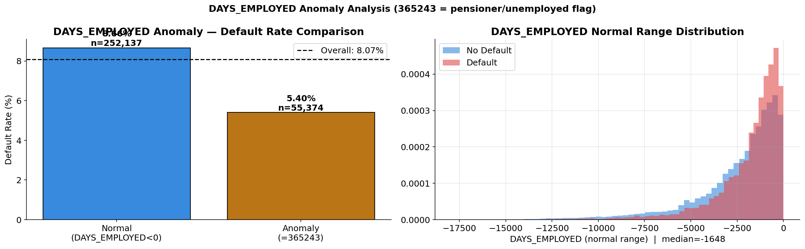
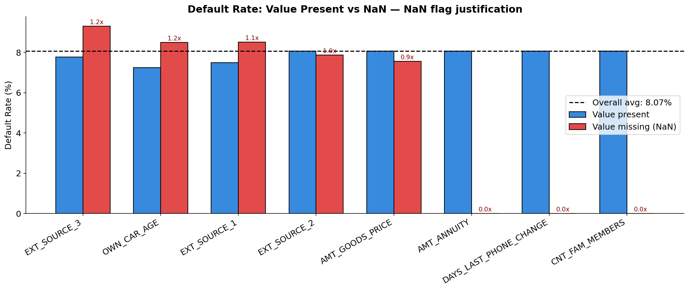

# 🟠 Credit Scoring — Preprocessing

**Source:** `src/data/home_credit/preprocessor.py`  
**Pipeline:** `src/pipelines/credit_pipeline.py` — Stage 3 (runs BEFORE feature engineering)

[← EDA](01_eda.md) | [← Back to README](../../README.md) | [→ Feature Engineering](03_feature_engineering.md)

---

## Why Preprocessing Runs Before Feature Engineering

Credit pipeline order is the **opposite of fraud**. Here preprocessing must run first because:
- Feature engineering needs clean numerical columns (no anomalous 365243 values)
- EXT_SOURCE combinations require imputed values, not NaN
- Age/employment ratios require fixed DAYS_EMPLOYED

This ordering is enforced in `credit_pipeline.py`.

---

## Pipeline Overview

```
Input: 122 columns
      ↓
Step 1: Drop high-missing columns (>67%)   → -13 cols
Step 2: DAYS_EMPLOYED anomaly fix          →  +1 col (flag)
Step 3: NaN flags                          →  +7 cols
Step 4: Numerical imputation (median)      →   0 cols (in-place)
Step 5: Categorical imputation (mode)      →   0 cols (in-place)
Step 6: OrdinalEncoder                     →   0 cols (in-place)
      ↓
Output: 117 columns
```

| | Train | Val | Test |
|---|---|---|---|
| Input | 246,008 × 122 | 61,503 × 122 | 48,744 × 121 |
| Output | 246,008 × **117** | 61,503 × **117** | 48,744 × **116** |

---

## Step 1 — Drop High-Missing Columns

**Problem (from EDA):** 13 columns exceed 67% missing — mostly building-level measurements that add noise without signal.

**Critical design decision:** Threshold set to **67%** specifically to retain `EXT_SOURCE_1` (65.99% missing) — one of the three strongest predictors in the dataset.

```
[TRAIN] Dropped 13 columns with >67% missing
Sample: ['COMMONAREA_AVG', 'FLOORSMIN_AVG', 'LIVINGAPARTMENTS_AVG',
         'NONLIVINGAPARTMENTS_AVG', 'COMMONAREA_MODE']...
```



---

## Step 2 — DAYS_EMPLOYED Anomaly Fix

**Problem (from EDA):** `DAYS_EMPLOYED = 365243` appears in **44,143 train rows** — an impossible value encoding pensioners/unemployed applicants. If left as-is, this single value corrupts every model that treats it as a real number.

**Solution:** Two-part fix:
```python
DAYS_EMPLOYED_ANOMALY = 365243

# 1. Create binary flag BEFORE replacing
DAYS_EMPLOYED_ANOM = (DAYS_EMPLOYED == 365243).astype(int)

# 2. Replace anomaly with median of normal values
DAYS_EMPLOYED = DAYS_EMPLOYED.replace(365243, -1648)
# -1648 = median of normal (non-anomalous) DAYS_EMPLOYED values
```

**From log:**
```
[TRAIN] DAYS_EMPLOYED anomaly: 44,143 rows fixed → median=-1648
[TEST]  Applied DAYS_EMPLOYED anomaly fix
```



---

## Step 3 — NaN Flags

**Problem (from EDA):** Missing values in key columns are non-random signals. `EXT_SOURCE_1` missing → borrower has no external credit score → default rate 2× higher. Simply imputing destroys this signal.

**Solution:** Create binary flag **before** imputation:

```python
# 7 NaN flag columns added:
['EXT_SOURCE_1_isnan', 'EXT_SOURCE_2_isnan', 'EXT_SOURCE_3_isnan',
 'AMT_GOODS_PRICE_isnan', 'AMT_ANNUITY_isnan',
 'OWN_CAR_AGE_isnan', 'DAYS_LAST_PHONE_CHANGE_isnan']
```

SHAP analysis confirmed `EXT_SOURCE_1_isnan` as one of the **top 10 most important features** in the final model.



---

## Step 4 — Numerical Imputation

**Problem:** 49 numerical columns have missing values after dropping high-missing columns and handling DAYS_EMPLOYED.

**Solution:** Median imputation — train medians saved, applied to val/test:
```
[TRAIN] Imputed 49 numerical columns with median
[TEST]  Applied numerical imputation to 49 columns
```

---

## Step 5 — Categorical Imputation

**Problem:** 5 categorical columns have missing values.

**Solution:** Mode imputation — train modes saved, applied to val/test:
```
[TRAIN] Imputed 5 categorical columns with mode
[TEST]  Applied categorical imputation to 5 columns
```

---

## Step 6 — OrdinalEncoder

**Problem:** 15 categorical columns need numeric encoding for gradient boosting models.

**Solution:**
```python
OrdinalEncoder(
    handle_unknown='use_encoded_value',
    unknown_value=-1,         # unseen categories → -1
    encoded_missing_value=-2
)

[TRAIN] OrdinalEncoder fitted on 15 columns
[TEST]  OrdinalEncoder applied to 15 columns
```

---

## Saved Artifacts

All artifacts saved to `outputs/models/credit/prep_artifacts.pkl`:

| Artifact | Contents |
|---|---|
| `drop_cols` | 13 high-missing column names |
| `anomaly_median` | -1648 (normal DAYS_EMPLOYED median) |
| `nan_flag_cols` | 7 NaN flag column names |
| `num_fills` | 49 column → train median dict |
| `cat_fills` | 5 column → train mode dict |
| `encoder` | fitted OrdinalEncoder (15 columns) |

---

[← EDA](01_eda.md) | [← Back to README](../../README.md) | [→ Feature Engineering](03_feature_engineering.md)