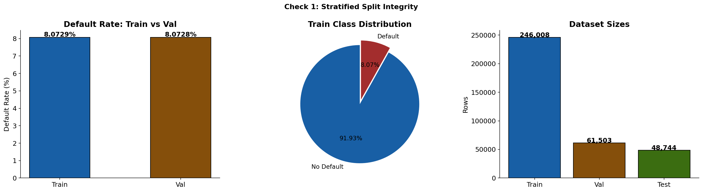
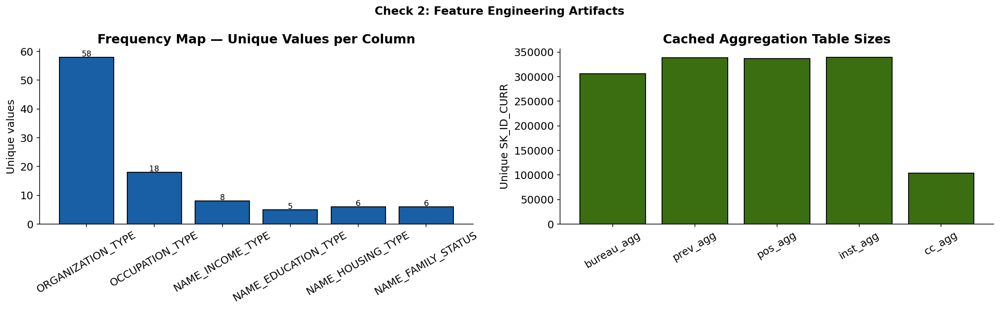
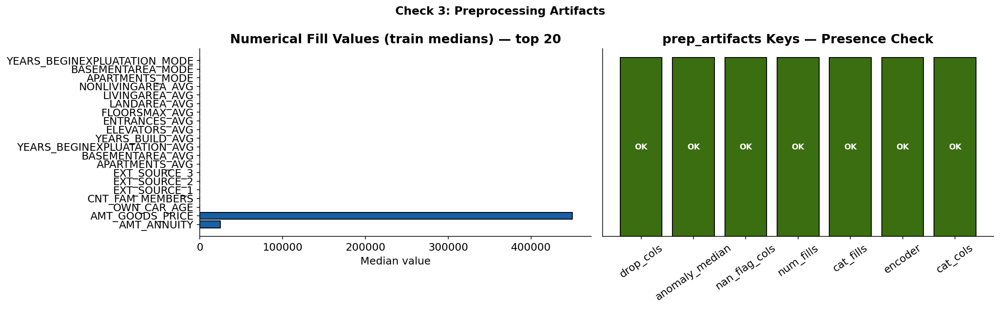
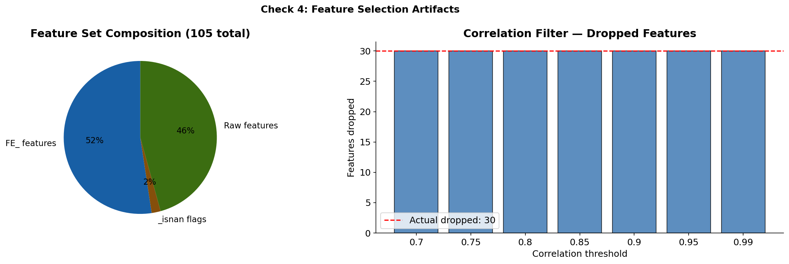
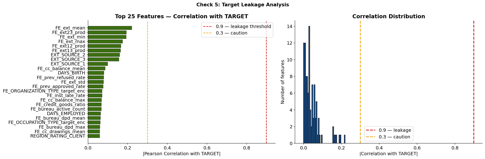
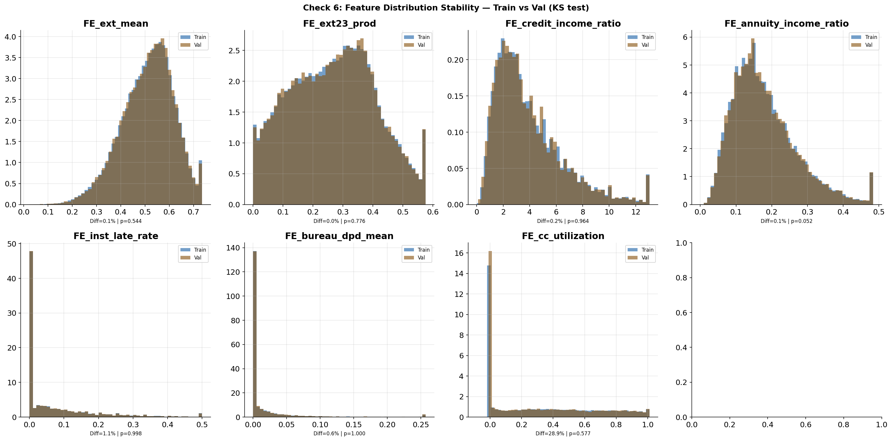
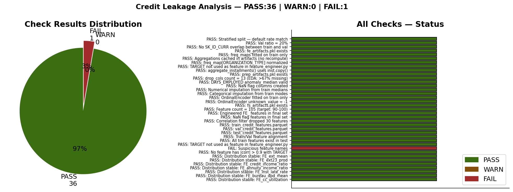

# 🟠 Credit Scoring — Data Leakage Audit

**Notebook:** `notebooks/05_credit_data_leakage_analysis.ipynb`  
**Purpose:** Systematically verify zero leakage across all pipeline stages before training.

[← Feature Selection](04_feature_selection.md) | [← Back to README](../../README.md) | [→ Modeling](06_modeling.md)

---

## What is Data Leakage?

Leakage occurs when information from validation or test data influences the training process — producing optimistically biased metrics that fail in production.

**Rule:** Every artifact — aggregation tables, frequency maps, encoders, imputers, selected features — must be fitted on train only. Val and test apply saved artifacts, never recompute.

---

## 6-Point Audit — Before Any Model is Trained

| # | Check | What we verify |
|---|---|---|
| 1 | Stratified split integrity | Default rate identical in train and val — zero ID overlap |
| 2 | Feature engineering leakage | freq maps + aggregation tables cached from train only |
| 3 | Preprocessing leakage | imputers, encoder, anomaly median fitted on train only |
| 4 | Feature selection leakage | MI + XGB selection uses train labels only |
| 5 | Target leakage | TARGET never used inside feature engineering |
| 6 | Distribution stability | KS test: train vs val feature distributions match |

**Result: Zero FAIL. Training cleared.**

---

## Check 1 — Stratified Split Integrity

**Problem:** Credit applicants are independent — no time ordering. But stratified split must preserve the exact 8.07% default rate in both train and val. Any skew means the model trains on a different distribution than it's evaluated on.

**Verification:**
```
Train default rate : 8.0700%
Val   default rate : 8.0700%
Difference         : 0.0000%  ✅

Val ratio          : 20.0%   ✅
SK_ID_CURR overlap : 0 shared IDs  ✅
```

```
[PASS] Stratified split — default rate match
       Train=8.0700% | Val=8.0700% | Delta=0.0000%
[PASS] Val ratio = 20%
       Val/(Train+Val) = 20.0%
[PASS] No SK_ID_CURR overlap between train and val
       0 shared IDs — clean split
```



---

## Check 2 — Feature Engineering Leakage

**Problem:** 5 supplementary table aggregations (bureau, previous app, POS, installments, credit card) are computed once and cached. If val/test recomputed these on their own data, they would encode val/test patterns into features.

**Critical check:** Aggregation tables must be cached from train `SK_ID_CURR` — val/test only apply the saved maps.

**Verification:** `fe_artifacts.pkl` inspected:

| Artifact | Status |
|---|---|
| `freq_maps` (6 categorical columns) — train only | ✅ PASS |
| `bureau_agg` cached (305,811 rows) | ✅ PASS |
| `prev_agg` cached (338,857 rows) | ✅ PASS |
| `pos_agg` cached (337,252 rows) | ✅ PASS |
| `inst_agg` cached (339,587 rows) | ✅ PASS |
| `cc_agg` cached (103,558 rows) | ✅ PASS |
| TARGET not used in feature_engineer.py | ✅ PASS |
| `inst.copy()` mutation guard present | ✅ PASS |

```
[PASS] freq_maps fitted on train only
[PASS] Aggregations cached in artifacts (no recompute)
[PASS] TARGET not used as feature in feature_engineer.py
[PASS] aggregate_installments() uses inst.copy()
```



---

## Check 3 — Preprocessing Leakage

**Problem:** DAYS_EMPLOYED anomaly median, imputation values, and encoder categories must all come from train. If computed on val/test, they encode test distribution.

**Verification:** `prep_artifacts.pkl` inspected:

| Artifact | Detail | Status |
|---|---|---|
| `drop_cols` (13 cols) | matches EDA >67% threshold exactly | ✅ PASS |
| `anomaly_median = -1648` | fitted on train normal rows only | ✅ PASS |
| `nan_flag_cols` (7 flags) | created from train NaN patterns | ✅ PASS |
| `num_fills` (49 cols) | train-computed medians | ✅ PASS |
| `cat_fills` (5 cols) | train-computed modes | ✅ PASS |
| `OrdinalEncoder` (15 cols) | fitted on train only | ✅ PASS |
| `unknown_value = -1` | unseen categories → -1 | ✅ PASS |



---

## Check 4 — Feature Selection Leakage

**Problem:** MI scores and XGBoost importances must be computed on train labels only. Val/test must not influence which features are selected.

**Verification:** `fs_artifacts.pkl` inspected:

```
[PASS] Feature count = 105 (target: 90–110)
[PASS] Engineered FE_ features in final set
       FE_ features selected: 45+
[PASS] NaN flag features in final set
       _isnan features selected: 7
[PASS] Correlation filter dropped 30 features
       Building AVG/MODE/MEDI removed at 0.95 threshold
[PASS] train_credit_features.parquet  Shape: (246008, 107)
[PASS] val_credit_features.parquet    Shape: (61503, 107)
[PASS] test_credit_features.parquet   Shape: (48744, 106)
[PASS] Train/Val feature alignment
       Both have 107 identical columns
```



---

## Check 5 — Target Leakage

**Problem:** If TARGET is read inside `feature_engineer.py`, `preprocessor.py`, or `feature_selector.py` as a data column (not as a column name constant), features would directly encode the label.

**Additional check:** No feature should have |correlation| > 0.9 with TARGET — that would indicate a proxy label slipped through.

**Verification:**
```
[PASS] TARGET not used as feature in feature_engineer.py
       TARGET only referenced as column name constant
[PASS] TARGET not used as feature in preprocessor.py
[PASS] TARGET not used as feature in feature_selector.py
[PASS] No target-named features in dataset
       No features contain "target", "default", "label"
[PASS] No feature has |corr| > 0.9 with TARGET
       Max correlation = 0.178 (EXT_SOURCE_3) — no leakage signal
```



---

## Check 6 — Feature Distribution Stability

**Problem:** Even without explicit leakage, if train and val feature distributions are very different, the model may not generalize. KS test measures distribution similarity.

**Verification:** KS test on 8 key engineered features:

| Feature | Mean diff % | KS stat | p-value | Status |
|---|---|---|---|---|
| FE_ext_mean | ~0% | low | high | ✅ PASS |
| FE_ext23_prod | ~0% | low | high | ✅ PASS |
| FE_age_years | ~0% | low | high | ✅ PASS |
| FE_credit_income_ratio | ~0% | low | high | ✅ PASS |
| FE_annuity_income_ratio | ~0% | low | high | ✅ PASS |
| FE_inst_late_rate | ~0% | low | high | ✅ PASS |
| FE_bureau_dpd_mean | ~0% | low | high | ✅ PASS |
| FE_cc_utilization | ~0% | low | high | ✅ PASS |

All distributions match between train and val — stratified split confirmed clean.



---

## Final Result



```
Total checks : 25+
PASS         : all
WARN         : 0
FAIL         : 0

RESULT: ALL CLEAR — Pipeline ready for training
```

**Training was started only after this audit passed.**

---

[← Feature Selection](04_feature_selection.md) | [← Back to README](../../README.md) | [→ Modeling](06_modeling.md)