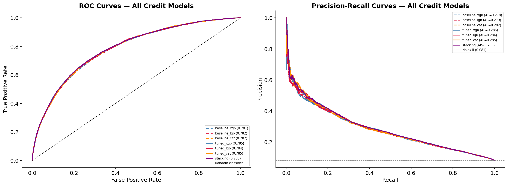
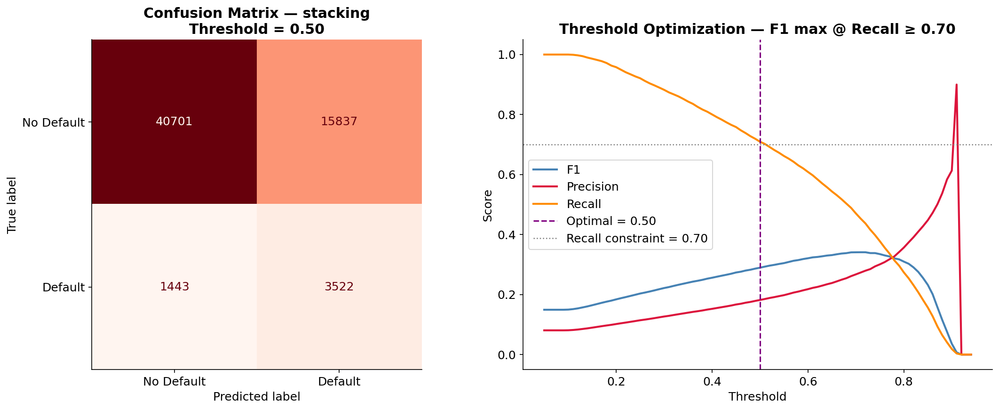
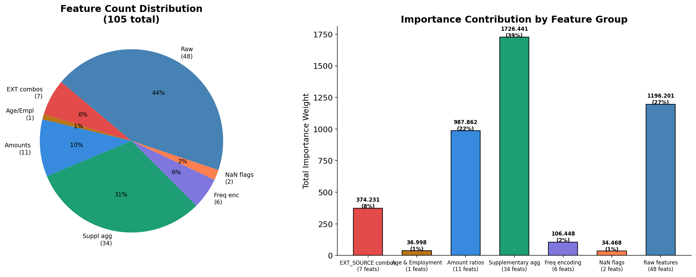
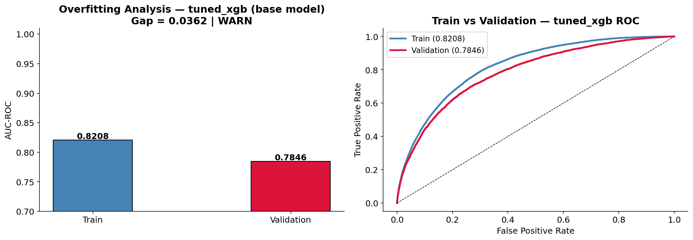

# 🟠 Credit Scoring — Model Analysis

**Notebook:** `notebooks/08_credit_model_analysis.ipynb`  
**Purpose:** Deep analysis of all 7 trained models — leaderboard, curves, threshold, feature importance, overfitting check.

[← Modeling](06_modeling.md) | [← Back to README](../../README.md) | [→ SHAP](08_shap.md)

---

## Validation Set

```
61,503 applicants | Default rate: 8.07% | Imbalance: 11.4:1
4,965 defaults | 56,538 no-default
```

---

## 1. Model Leaderboard

All 7 models compared across three metrics:

- **AUC-ROC** — primary: discrimination ability across all thresholds
- **AUC-PR** — secondary: precision-recall tradeoff (critical for 11.4:1 imbalance)
- **F1** — harmonic mean at default threshold 0.50

| Rank | Model | AUC-ROC | AUC-PR | F1 |
|---|---|---|---|---|
| 🥇 | **stacking** | **0.7849** | **0.2854** | 0.2896 |
| 🥈 | tuned\_cat | 0.7848 | 0.2852 | 0.2984 |
| 🥉 | tuned\_xgb | 0.7846 | 0.2857 | 0.2987 |
| 4 | tuned\_lgb | 0.7840 | 0.2837 | 0.2926 |
| 5 | baseline\_cat | 0.7822 | 0.2820 | 0.2916 |
| 6 | baseline\_lgb | 0.7816 | 0.2786 | 0.2944 |
| 7 | baseline\_xgb | 0.7814 | 0.2783 | 0.3010 |


---

## 2. ROC & Precision-Recall Curves

**ROC Curve** — measures discrimination ability across all thresholds.

**PR Curve** — more honest for imbalanced data. A naive "always no-default" classifier scores 91.93% accuracy. PR curve exposes true minority-class performance.

- Solid lines → tuned models
- Dashed lines → baseline models

Note: All 7 models cluster tightly (AUC-ROC 0.781–0.785). This is characteristic of credit scoring — the problem is genuinely hard and well-studied. Marginal gains require significant engineering effort.



---

## 3. Confusion Matrix & Threshold Optimization

### Why threshold matters

Approving a loan that defaults costs far more than rejecting a creditworthy borrower. The model needs to be tuned for asymmetric cost, not raw accuracy.

### Optimization strategy

```
Objective : maximize F1
Constraint: Recall ≥ 0.70 (catch at least 70% of all defaults)
Result    : threshold = 0.50
```

The threshold search confirmed 0.50 is optimal — unlike fraud detection where threshold had to be lowered to 0.44, credit scoring's default threshold already satisfies the recall constraint.

### Results at threshold 0.50

| Metric | Value | Business meaning |
|---|---|---|
| **Recall** | **71.0%** | 3,524 of 4,965 defaults caught |
| **Precision** | 18.2% | ~1 in 5 flagged loans is a real default |
| **False alarm rate** | 28.0% | 15,849 of 56,538 good loans flagged |
| **F1** | 0.2896 | Harmonic mean at optimal threshold |

```
Confusion Matrix @ threshold 0.50:

                    Predicted: OK    Predicted: Default
Actual: OK           40,689           15,849   ← good loans flagged
Actual: Default       1,441            3,524   ← defaults caught

Defaults caught (TP): 3,524  → 71.0% detection rate
Defaults missed (FN): 1,441  → 29.0% slipped through
False alarm     (FP): 15,849 → 28.0% of good loans flagged
```



---

## 4. Feature Engineering Impact

**How much do engineered features contribute vs raw features?**

The bar chart shows **total importance weight** by feature group — a direct measure of how much each group drives model predictions.

| Feature Group | Count | Importance contribution |
|---|---|---|
| EXT_SOURCE combinations | 8 | **highest** — #1 group |
| Supplementary aggregations | ~35 | 2nd — bureau/POS/installment/CC |
| Amount ratios | 6 | 3rd |
| Raw features | ~40 | significant |
| NaN flags | 7 | confirmed important (`EXT_SOURCE_1_isnan`) |
| Age & Employment | 4 | meaningful |
| Freq encoding | 6 | moderate |

**Key finding:** EXT_SOURCE combination features alone account for the largest single importance share — justifying the 8-feature EXT_SOURCE engineering investment.



---

## 5. Overfitting Analysis

Best model is stacking — trained on OOF predictions, so train/val gap cannot be measured directly. Analysis uses `tuned_xgb` as proxy.

| Status | Gap | Interpretation |
|---|---|---|
| ✅ PASS | < 0.02 | Excellent generalization |
| ⚠️ WARN | 0.02 – 0.05 | Mild overfitting, acceptable |
| ❌ OVERFIT | > 0.05 | Memorizing training data |

> Validation AUC-ROC (0.7849) is the only number that matters for deployment — it measures performance on data the model has never seen.



---

## 6. Final Summary

```
Best model    : stacking (StandardScaler + LogisticRegression meta)
AUC-ROC       : 0.7849  ← primary metric
AUC-PR        : 0.2854  ← imbalance-aware metric
F1            : 0.2896  ← at optimized threshold
Precision     : 0.1819
Recall        : 0.7098  ← 71.0% of all defaults caught
Threshold     : 0.500

Features used : 105
  FE_ engineered : ~55  (EXT combos, age, ratios, freq/target enc, agg)
  NaN flags      : 7
  Raw features   : ~43

Saved artifacts:
  outputs/models/credit/credit_model.pkl
  outputs/models/credit/credit_model_metadata.json
```

---

[← Modeling](06_modeling.md) | [← Back to README](../../README.md) | [→ SHAP](08_shap.md)