# 🟠 Credit Scoring — SHAP Explainability

**Source:** `src/explainability/shap_explainer.py`  
**Notebook:** `notebooks/09_credit_shap_analysis.ipynb`  
**Model:** tuned_xgb (TreeExplainer, stacking → XGBoost base) | 2,000 samples | 105 features

[← Model Analysis](07_model_analysis.md) | [← Back to README](../../README.md)

---

## What is SHAP?

SHAP (SHapley Additive exPlanations) assigns each feature a contribution value for every prediction. It explains **why the model flagged a specific applicant as high default risk** — essential for credit decisions that must be auditable.

```
Base value        : -0.0134  (average log-odds across val set)
SHAP values shape : (2000, 105)

For any applicant:
  default_score = base_value + sum(SHAP contributions of all 105 features)
```

---

## 1. Global SHAP — Bar Plot

Mean absolute SHAP value per feature — overall importance across 2,000 val set samples.

Top global features by mean |SHAP|: `FE_ext_mean`, `FE_ext23_prod`, `FE_prev_credit_sum`, `FE_bureau_active_count`, `EXT_SOURCE_1_isnan`

All top features are engineered — confirming the FE investment paid off.

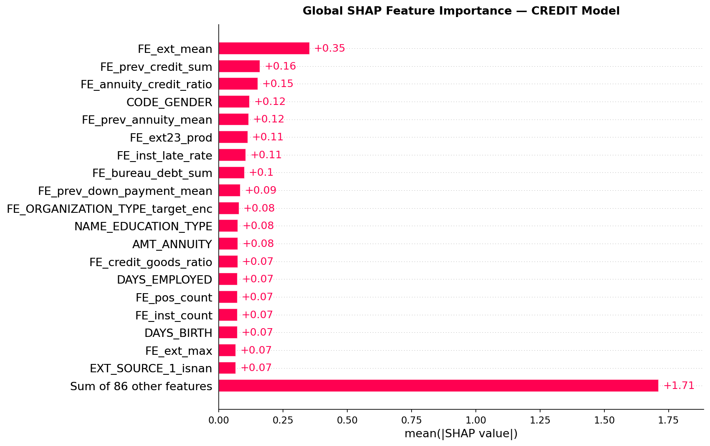

---

## 2. Global SHAP — Beeswarm Plot

Each dot = one applicant. X-axis = SHAP value (impact on default probability). Color = feature value (red=high, blue=low).

Key directions visible:
- High `FE_ext_mean` → strongly **reduces** default risk (higher external score = safer)
- `EXT_SOURCE_1_isnan = 1` → **increases** default risk (missing bureau score = risky)
- High `FE_prev_credit_sum` → can **increase** risk (heavy prior borrowing)

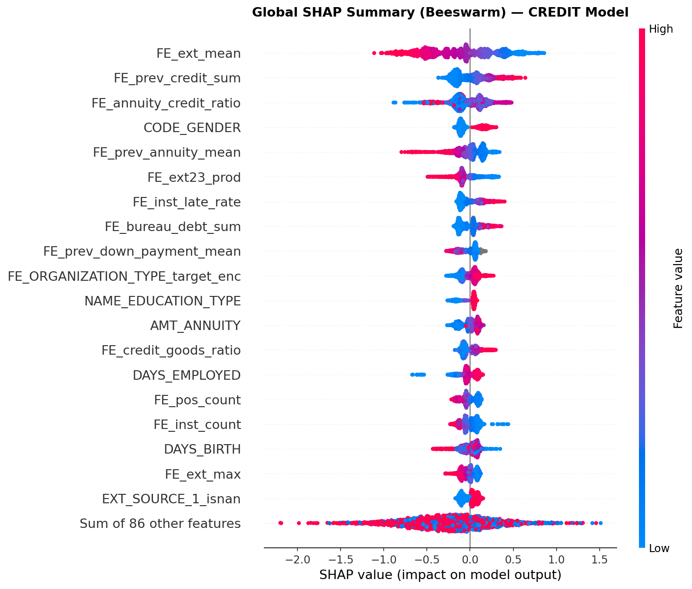

---

## 3. Global SHAP — Heatmap

Feature × sample heatmap showing SHAP values across 2,000 samples. Reveals clusters of applicants who share similar risk profiles — groups driven by EXT_SOURCE vs groups driven by bureau history.

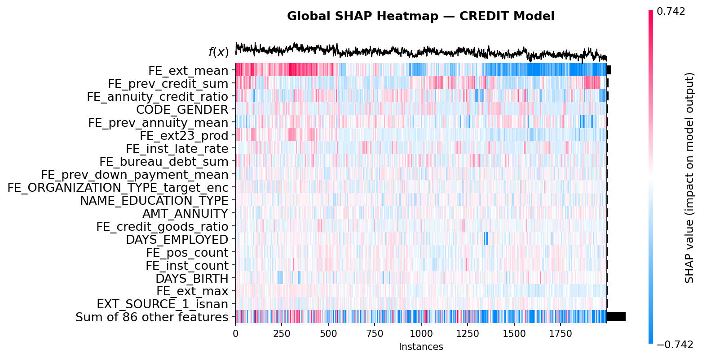

---

## 4. Mean |SHAP| — Custom Bar

Top features ranked by mean absolute SHAP — color-coded by feature type:
- 🔴 Crimson — engineered features (`FE_*`)
- 🟠 Coral — NaN flags (`_isnan`)
- 🔵 Steel blue — raw features

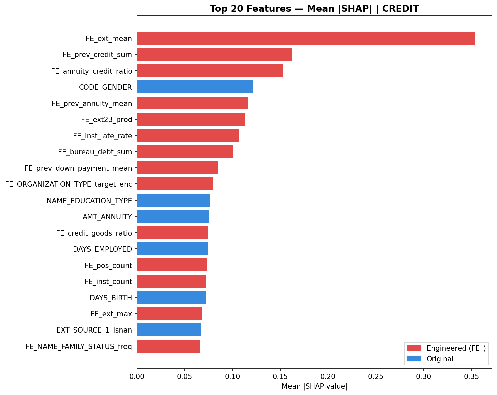

---

## 5. Positive vs Negative SHAP Split

For each top feature: how much SHAP weight pushes toward default (positive) vs away from default (negative). EXT_SOURCE features are strongly one-directional — they almost exclusively reduce risk.

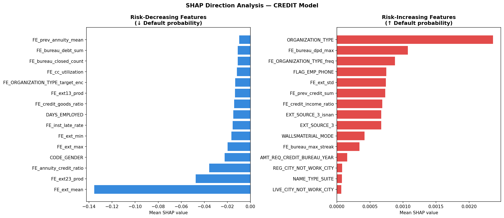

---

## 6. FE vs Raw Contribution — Key Result

**How much did feature engineering actually help?**

```
FE features contribution  : 2.5943  (69.0%)
Raw features contribution : 1.1635  (31.0%)
```

**Engineered features account for 69% of total SHAP weight** despite being ~52% of features (55/105). This is the quantitative proof that feature engineering was the most impactful part of the pipeline.

EXT_SOURCE combinations alone (8 features) account for the largest single contribution share — confirming why `FE_ext_mean` is the #1 most important feature.

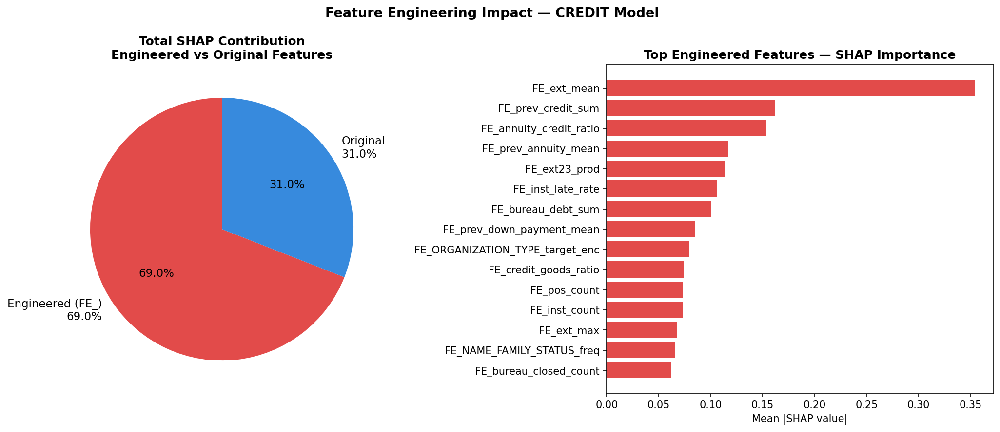

---

## 7. Local Explanation — Default Case

Single applicant explanation — a borrower the model flags as high default risk.

```
Base value (avg default prob) : -0.0134
SHAP prediction               :  0.1998

Top 10 risk factors:
  FE_prev_credit_sum           +0.2629  ↑ Default  ← large prior loan history
  FE_bureau_active_count       +0.2078  ↑ Default  ← many active credits
  FE_bureau_closed_count       -0.1955  ↓ Default  ← few closed (reducing risk)
  FE_ext_mean                  +0.1556  ↑ Default  ← low external score
  FE_prev_annuity_mean         -0.1439  ↓ Default  ← lower annuity reducing risk
  FE_ORGANIZATION_TYPE_target_enc -0.1352 ↓ Default
  AMT_ANNUITY                  -0.1311  ↓ Default
```

**8 of top 10 contributors are engineered features** — the model's decision for this applicant is driven almost entirely by FE-derived signals.

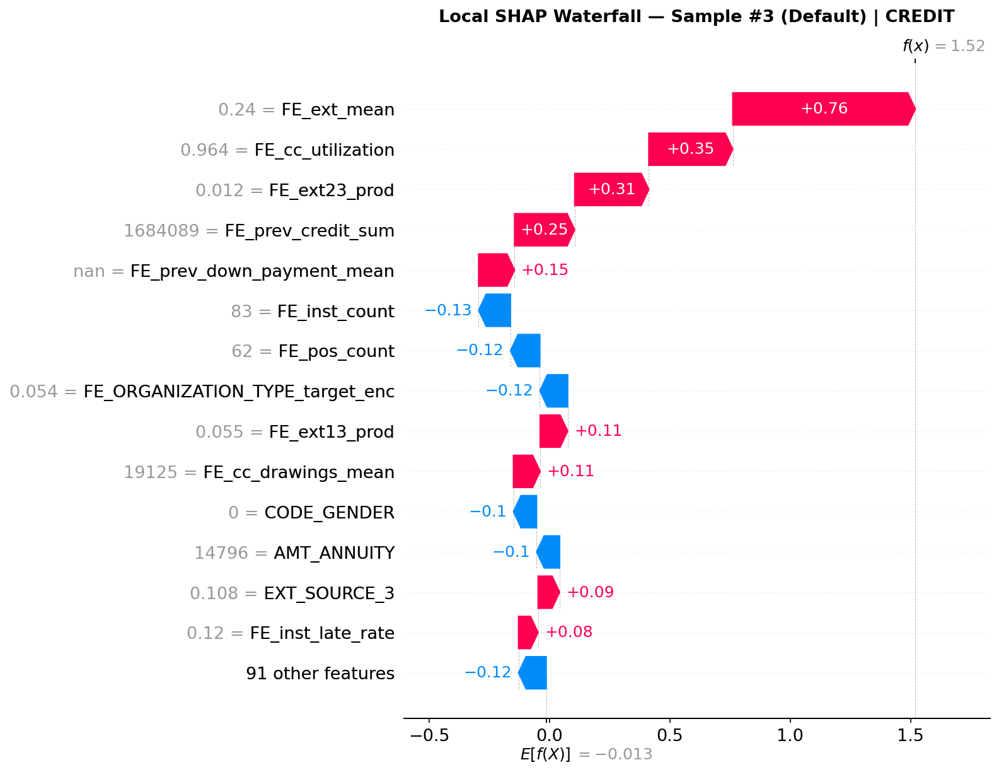

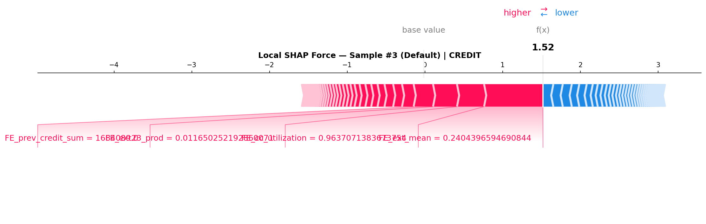

---

## 8. Local Explanation — No-Default Case

A borrower the model is confident will repay — SHAP values push strongly away from default.

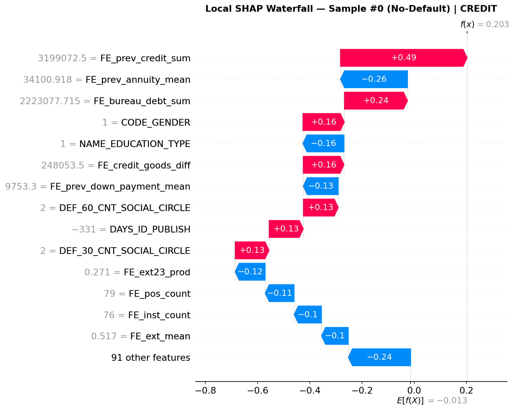

---

## 9. Dependence Plots — Top 3 Features

How SHAP value changes as feature value changes. Interaction coloring reveals which second feature modifies the effect.

**Top 3 features by mean |SHAP|:** `FE_ext_mean`, `FE_prev_credit_sum`, `FE_annuity_credit_ratio`

### FE_ext_mean (interaction: FE_prev_credit_sum)
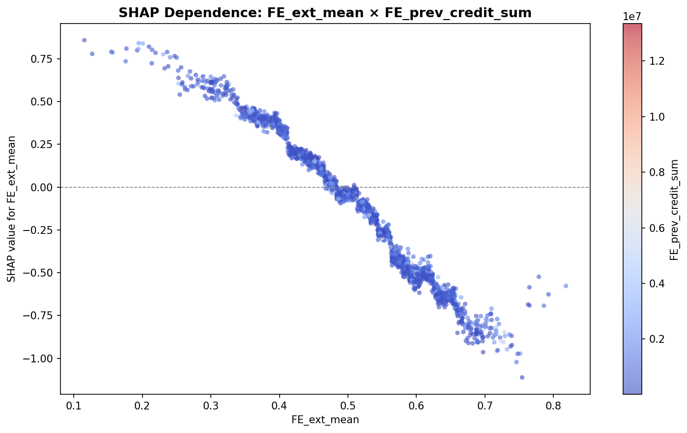

### FE_prev_credit_sum (interaction: FE_annuity_credit_ratio)
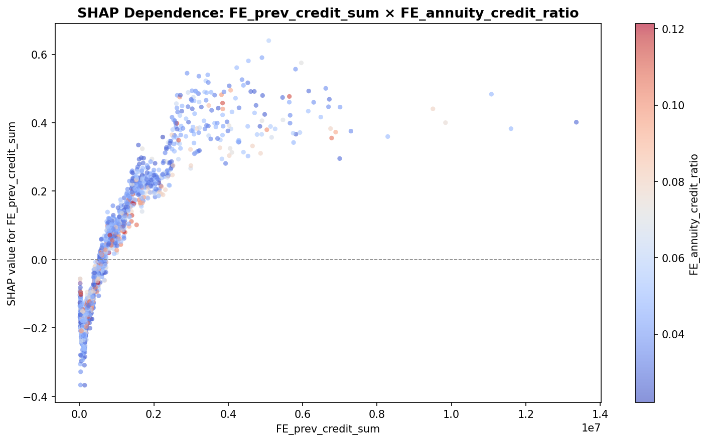

### FE_annuity_credit_ratio
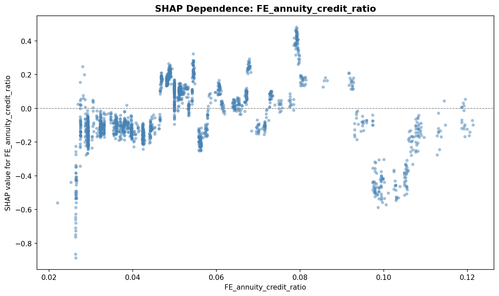

---

## Summary

| Finding | Detail |
|---|---|
| Base value | -0.0134 (avg log-odds) |
| **FE contribution** | **69.0%** of total SHAP weight |
| Raw contribution | 31.0% of total SHAP weight |
| #1 global feature | `FE_ext_mean` (EXT_SOURCE combination) |
| #2 global feature | `FE_ext23_prod` (EXT2 × EXT3 product) |
| NaN flag confirmed | `EXT_SOURCE_1_isnan` in top 5 globally |
| Default case | 8/10 top contributors are engineered features |
| Top dependence features | FE_ext_mean, FE_prev_credit_sum, FE_annuity_credit_ratio |

---

[← Model Analysis](07_model_analysis.md) | [← Back to README](../../README.md)