# 🚀 FinRiskGuard — Deployment Documentation

End-to-end deployment of two production ML systems: Fraud Detection and Credit Default Scoring — from a local FastAPI server to a live cloud deployment with automated CI/CD.

---

## Deployment Stack

```
FastAPI inference service       ← prediction logic, REST API
        ↓
Docker containerization         ← portable, reproducible packaging
        ↓
GitHub Actions CI/CD            ← automated test → build → push → deploy
        ↓
AWS EC2 (t3.micro, Seoul)       ← 24/7 cloud production server
        ↓
Gradio demo UI (HF Spaces)      ← permanent public demo, no EC2 needed
```

---

## 1. FastAPI Inference Service

### 1.1 Architecture

The inference pipeline applies the **exact same transformations as training — in the same order**. This guarantees zero training-serving skew:

```
Raw input → Feature Engineering → Preprocessing → Feature Selection → Model → Decision
```

**`src/pipelines/predict_pipeline.py`** contains two predictors:

- `FraudPredictor` — loads `fraud_model.pkl`, `fe_artifacts.pkl`, `prep_artifacts.pkl`, `fs_artifacts.pkl`
- `CreditPredictor` — loads `credit_model.pkl` and corresponding artifacts

Both support single prediction (`predict_single`) and batch prediction (`predict`) up to 10,000 records per request.

**Stacking ensemble handling:** `fraud_model.pkl` is `tuned_xgb`. `credit_model.pkl` is `Pipeline(StandardScaler + LogisticRegression)` — the stacking meta-learner. The predictor detects this automatically and routes through the three base models (`tuned_xgb`, `tuned_lgb`, `tuned_cat`) first, then passes their probabilities to the meta-learner.

---

### 1.2 API Endpoints

| Method | Endpoint | Description |
|--------|----------|-------------|
| `GET` | `/health` | Health check — returns `{"status": "ok"}` |
| `GET` | `/` | Service info |
| `POST` | `/api/v1/fraud/predict` | Single transaction fraud score |
| `POST` | `/api/v1/fraud/batch` | Batch transaction scoring (up to 10,000) |
| `GET` | `/api/v1/fraud/metadata` | Model metrics, threshold, feature count |
| `POST` | `/api/v1/credit/predict` | Single applicant credit score |
| `POST` | `/api/v1/credit/batch` | Batch applicant scoring (up to 10,000) |
| `GET` | `/api/v1/credit/metadata` | Model metrics, threshold, feature count |

---

### 1.3 Threshold-Based Business Decision

Thresholds are **business-optimized**: `Recall ≥ 0.70` constraint, then maximize F1 — reflecting the asymmetric cost of missing fraud vs. a false alarm. Default 0.50 would optimize accuracy, not business value.

**Fraud endpoint response:**
```json
{
  "fraud_probability": 0.0815,
  "is_fraud": false,
  "threshold": 0.44,
  "model": "tuned_xgb",
  "decision": "LEGITIMATE"
}
```

**Credit endpoint response:**
```json
{
  "default_probability": 0.1255,
  "will_default": false,
  "threshold": 0.50,
  "model": "stacking",
  "risk_label": "LOW_RISK"
}
```

---

### 1.4 Local Test

Start the server locally:

```bash
uvicorn api.main:app --reload
```

- **Swagger UI:** `http://127.0.0.1:8000/docs`
- **Health check:** `http://127.0.0.1:8000/health`

**Figure 1 — FastAPI Swagger UI (local): Fraud prediction, HTTP 200**

The fraud endpoint is tested via Swagger UI at `http://127.0.0.1:8000/docs`. Request body: `TransactionID: 2987004`, `TransactionDT: 86400`, `TransactionAmt: 117.5`. The response returns all five fields correctly: `fraud_probability: 0.08146`, `is_fraud: false`, `threshold: 0.44`, `model: tuned_xgb`, `decision: LEGITIMATE`.

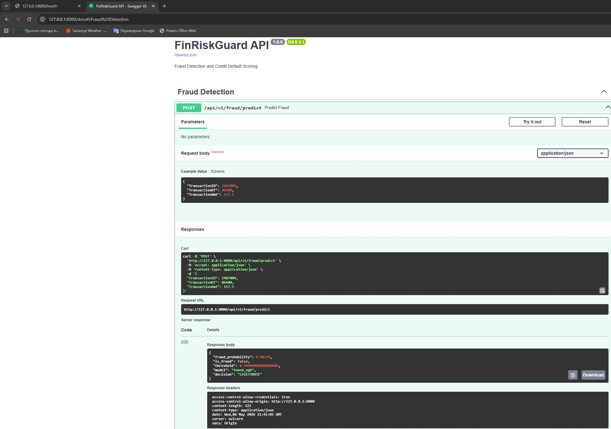

---

**Figure 2 — FastAPI Swagger UI (local): Credit prediction, HTTP 200**

The credit endpoint at `/api/v1/credit/predict` is tested with applicant data: `SK_ID_CURR: 100002`, `AMT_CREDIT: 406597.5`, `AMT_INCOME_TOTAL: 202500`, `EXT_SOURCE_2: 0.651`, `EXT_SOURCE_3: 0.493`. The stacking ensemble returns `default_probability: 0.125526`, `will_default: false`, `threshold: 0.50`, `model: stacking`, `risk_label: LOW_RISK`.

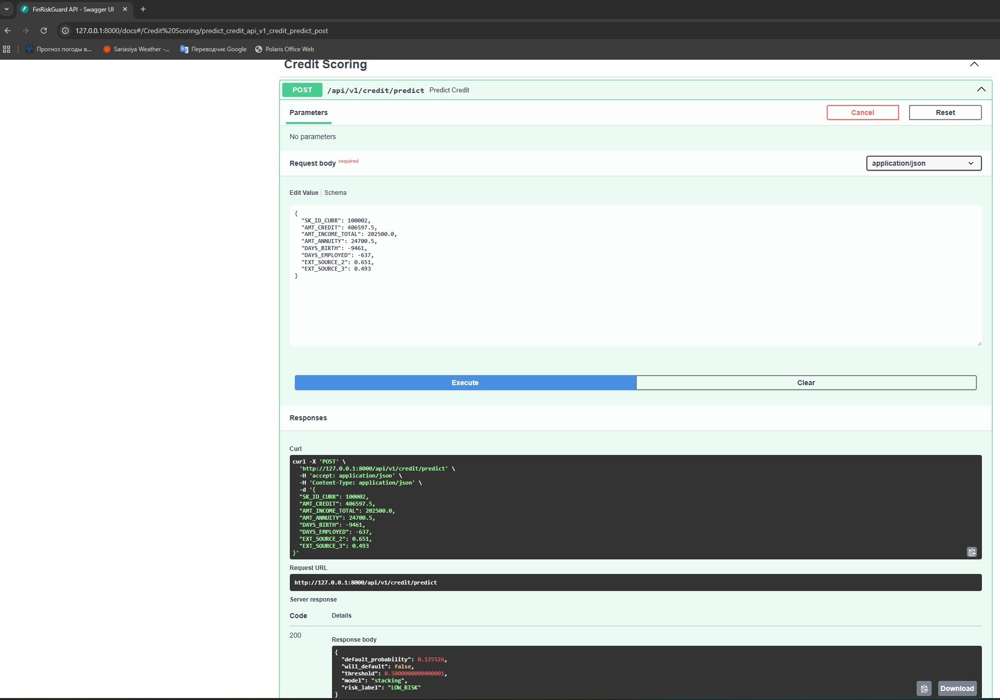

---

## 2. Docker Containerization

### 2.1 Dockerfile

The API Dockerfile (`deploy/docker/Dockerfile`) builds a production-ready, self-contained image:

1. **Base image:** `python:3.11-slim`
2. **System deps:** `gcc`, `g++`, `libgomp1` (required by LightGBM and XGBoost native libs)
3. **Python deps:** installed from `requirements.txt`
4. **Source code:** `src/`, `api/`, `configs/` copied into `/app`
5. **Model artifacts:** downloaded from S3 at build time using `ARG` build arguments — credentials are **not baked into the final image**
6. **Health check:** polls `GET /health` every 30 seconds
7. **Entrypoint:** `uvicorn api.main:app --host 0.0.0.0 --port 8000 --workers 1`

A separate `Dockerfile.gradio` builds the Gradio demo container (port 7860).

---

### 2.2 Build and Run

```bash
# Build the API image
docker build -t finriskguard-api -f deploy/docker/Dockerfile .

# Run the container
docker run -d \
  --name finriskguard-api \
  -p 8000:8000 \
  -e PYTHONPATH=/app \
  finriskguard-api

# Tail logs
docker logs finriskguard-api
```

---

### 2.3 Container Running — Docker Desktop

**Figure 3 — Docker Desktop: finriskguard-api running (healthy)**

Terminal output confirms the full startup sequence: Uvicorn spawns worker processes on `0.0.0.0:8000`, both Fraud and Credit models load into memory, and the health check returns `GET /health HTTP/1.1 → 200 OK`. Docker Desktop shows the container live on port `8000:8000` with CPU at `0.38%` and memory at `666.2 MB` — well within the EC2 t3.micro limit. Container ID: `bd73d87bc2b5`.

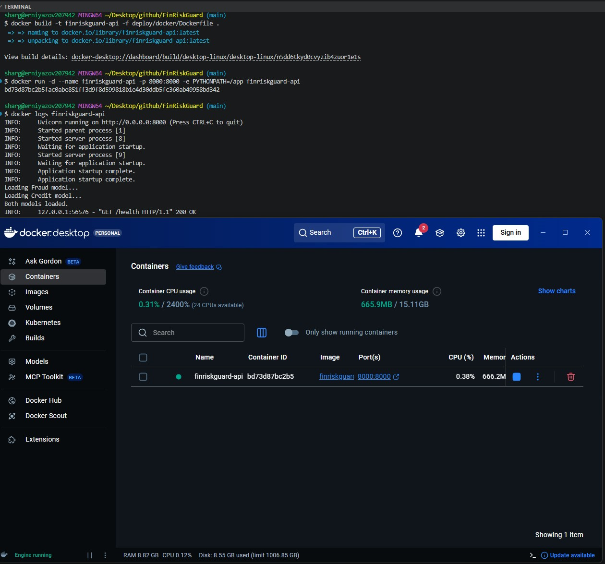

---

## 3. GitHub Actions CI/CD

### 3.1 Pipeline: `.github/workflows/deploy.yml`

Every push to `main` triggers three sequential jobs:

```
push to main
    ↓
[Job 1] Run Tests (~54s)
    ├── pytest across all src/ modules
    └── gates all downstream jobs — failure here stops the pipeline
    ↓
[Job 2] Build and Push Docker Images (~3m 51s)
    ├── docker build finriskguard-api  (passes AWS credentials as ARGs for S3 model download)
    ├── docker build finriskguard-gradio
    └── docker push both images to Docker Hub as :latest
    ↓
[Job 3] Deploy to AWS EC2 (~10–23m)
    ├── SSH into EC2 using EC2_SSH_KEY secret
    ├── docker pull shargun1303/finriskguard-api:latest
    ├── docker pull shargun1303/finriskguard-gradio:latest
    ├── Stop and remove old containers
    ├── docker run finriskguard-api on port 8000
    ├── Health check: curl localhost:8000/health
    └── docker run finriskguard-gradio on port 7860
```

---

### 3.2 GitHub Secrets Required

| Secret | Description |
|--------|-------------|
| `DOCKER_USERNAME` | Docker Hub username (`shargun1303`) |
| `DOCKER_PASSWORD` | Docker Hub access token (Read & Write scope) |
| `AWS_ACCESS_KEY_ID` | AWS access key — passed as Docker `ARG` for S3 model download |
| `AWS_SECRET_ACCESS_KEY` | AWS secret key — passed as Docker `ARG` |
| `EC2_HOST` | EC2 public IPv4 address (`15.164.213.181`) |
| `EC2_USER` | `ubuntu` |
| `EC2_SSH_KEY` | Full content of the EC2 private key (`.pem`) |

---

### 3.3 Docker Hub

After a successful build, two repositories are updated:

- `shargun1303/finriskguard-api:latest`
- `shargun1303/finriskguard-gradio:latest`

---

### 3.4 CI/CD Screenshots

**Figure 4 — GitHub Actions: All workflow runs**

The Actions tab shows 6 runs — the real iteration process behind getting the deployment stable. Runs #2 and #3 failed during initial setup (triggering Actions, fixing S3 model download in Dockerfile). Runs #5 and #6 failed on EC2 resource issues (reducing Uvicorn workers for t3.micro memory limit, disk resize). Run #4 was the first fully successful deploy. Run #7 (`Fix: increase SSH command timeout to 30m`) is the latest successful run, completing in **23m 24s**.

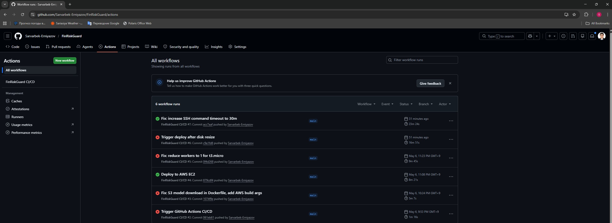

---

**Figure 5 — GitHub Actions: Detailed run view**

The three-job pipeline is visible with timing: `Run Tests ✅ (52s)` → `Build and Push Docker Images ✅ (3m 51s)` → `Deploy to AWS EC2`. The pipeline structure, job sequencing, and artifact flow are all confirmed working. Annotations show Node.js 20 deprecation warnings across all three jobs — non-blocking, scheduled migration to Node.js 24 before June 2026.

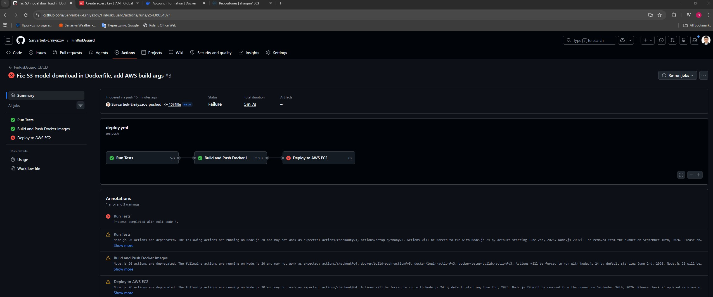

---

## 4. AWS EC2 Deployment

### 4.1 Instance Configuration

| Parameter | Value |
|-----------|-------|
| Instance type | `t3.micro` (2 vCPU, 1 GB RAM) |
| AMI | Ubuntu 24.04 LTS |
| Region | `ap-northeast-2` (Seoul) |
| Storage | 20 GiB gp3 SSD |
| Security groups | TCP 22 (SSH), TCP 8000 (API), TCP 7860 (Gradio) |
| Public IP | `15.164.213.181` |

---

### 4.2 Model Artifacts — AWS S3

Model artifacts (170 MB total) are stored in S3 bucket `finriskguard-models` and downloaded at Docker build time:

```
s3://finriskguard-models/models/fraud/   → 36 MB  (15 files)
s3://finriskguard-models/models/credit/  → 134 MB (16 files)
```

AWS credentials are passed as Docker `ARG` build arguments — used only during the build step and **not present in the final image layers**.

---

### 4.3 Docker on EC2

Docker is installed on the EC2 instance with:

```bash
curl -fsSL https://get.docker.com | sudo sh
sudo usermod -aG docker ubuntu
```

GitHub Actions manages the container lifecycle via SSH on every push to `main`.

---

### 4.4 Live Endpoints

```
http://15.164.213.181:8000/health   →  {"status": "ok", "service": "FinRiskGuard API"}
http://15.164.213.181:8000/docs     →  Swagger UI (interactive API docs)
http://15.164.213.181:7860          →  Gradio Demo UI
```

---

### 4.5 EC2 Screenshots

**Figure 6 — AWS EC2: Health check**

`GET http://15.164.213.181:8000/health` returns `{"status":"ok","service":"FinRiskGuard API"}` from the live EC2 instance. This confirms both containers are up, Uvicorn is serving requests, and both models loaded successfully on the remote machine.

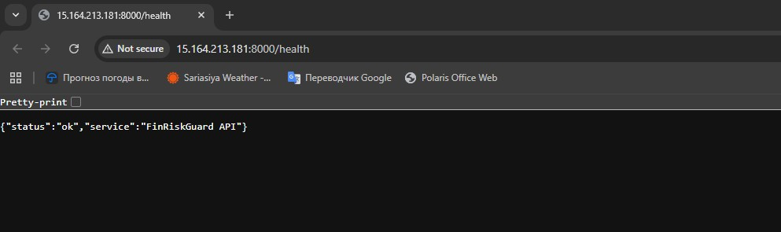

---

**Figure 7 — AWS EC2: Swagger UI — Fraud prediction**

The Swagger UI is live at `http://15.164.213.181:8000/docs`. The fraud endpoint is tested remotely with the same request as local: `TransactionID: 2987004`, `TransactionAmt: 117.5`. Response: `fraud_probability: 0.08146`, `is_fraud: false`, `decision: LEGITIMATE`, `model: tuned_xgb`, `threshold: 0.44` — **identical to the local response**, confirming zero training-serving skew across environments.

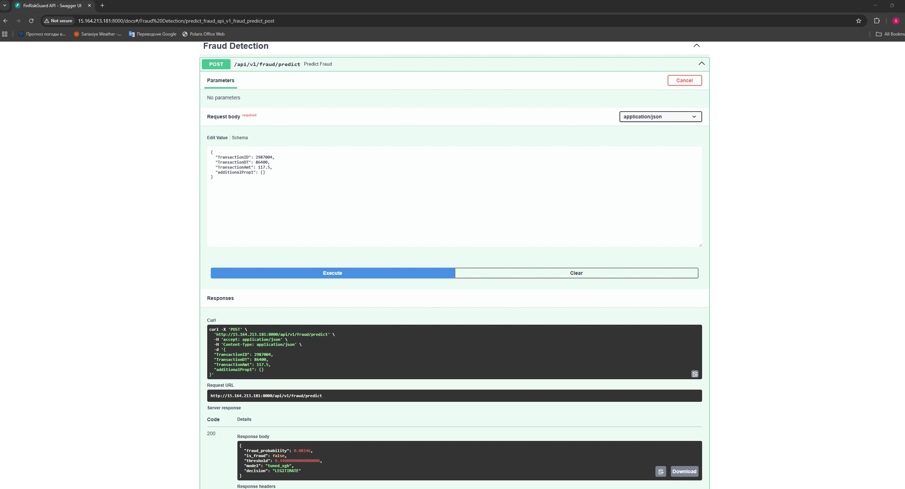

---

**Figure 8 — AWS EC2: Swagger UI — Credit prediction**

The credit endpoint at `http://15.164.213.181:8000/docs` is tested with the same applicant data. Response: `default_probability: 0.112254`, `will_default: false`, `model: stacking`, `risk_label: LOW_RISK`, `threshold: 0.50` — consistent with local results.

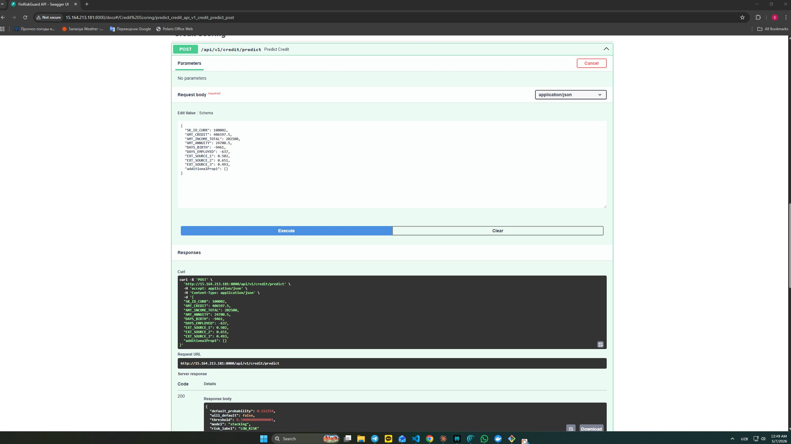

---

**Figure 9 — AWS EC2: Gradio Demo UI**

The Gradio UI is live at `http://15.164.213.181:7860` — running as a second Docker container on the same EC2 instance. The Credit Scoring tab shows applicant `SK_ID_CURR: 100002` with `EXT_SOURCE_1: 0` (missing — encoded as default risk signal by the pipeline), `EXT_SOURCE_2: 0.651`, `EXT_SOURCE_3: 0.493`. The stacking model returns `Default Probability: 0.1971`, `Decision: GREEN — LOW RISK`.

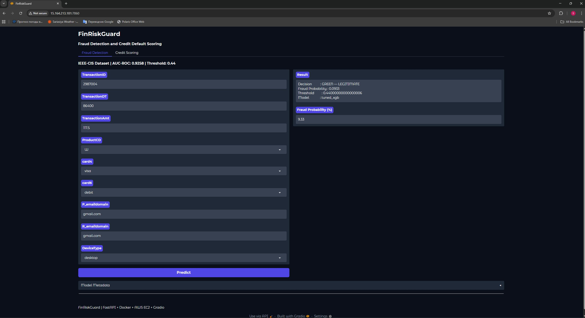

---

## 5. Gradio Demo UI — Hugging Face Spaces

### 5.1 Overview

The demo is **permanently hosted on Hugging Face Spaces** — no EC2 or S3 required. Model artifacts (170 MB) are stored directly in the Space repository via Git LFS, so the demo stays live even if the EC2 instance is stopped or terminated.

**🎯 Live demo:** [https://huggingface.co/spaces/Sarvarbek13/FinRiskGuard](https://huggingface.co/spaces/Sarvarbek13/FinRiskGuard)

---

### 5.2 Demo Features

**Fraud Detection tab**

- **Dataset:** IEEE-CIS | **AUC-ROC:** 0.9258 | **Threshold:** 0.44
- **Inputs:** `TransactionID`, `TransactionDT`, `TransactionAmt`, `ProductCD`, `card4`, `card6`, `P_emaildomain`, `R_emaildomain`, `DeviceType`
- **Outputs:** Decision (GREEN — LEGITIMATE / RED — FRAUD), fraud probability %, threshold, model name
- **Model:** `tuned_xgb` — best single model, AUC-ROC 0.9258

**Credit Scoring tab**

- **Dataset:** Home Credit | **AUC-ROC:** 0.7849 | **Threshold:** 0.50
- **Inputs:** `SK_ID_CURR`, `AMT_CREDIT`, `AMT_INCOME_TOTAL`, `AMT_ANNUITY`, `DAYS_BIRTH`, `DAYS_EMPLOYED`, `EXT_SOURCE_1`, `EXT_SOURCE_2`, `EXT_SOURCE_3`
- **Outputs:** Decision (GREEN — LOW RISK / RED — HIGH RISK), default probability %, threshold, model name
- **Model:** `stacking` — meta-learner over tuned_xgb + tuned_lgb + tuned_cat, best AUC-ROC 0.7849

Both tabs include an expandable **Model Metadata** accordion showing AUC-ROC, AUC-PR, F1, threshold, and number of features used.

---

### 5.3 HF Spaces Screenshots

**Figure 10 — Gradio Fraud Detection (Hugging Face Spaces)**

The Fraud Detection tab at `huggingface.co/spaces/Sarvarbek13/FinRiskGuard`. Transaction: `TransactionID 2987004`, `TransactionAmt 117.5`, card `visa/debit`, email `gmail.com`, device `desktop`. Result: `Decision: GREEN — LEGITIMATE`, `Fraud Probability: 0.0933` (9.33%), `Model: tuned_xgb`, `Threshold: 0.44`. Consistent with EC2 and local results.

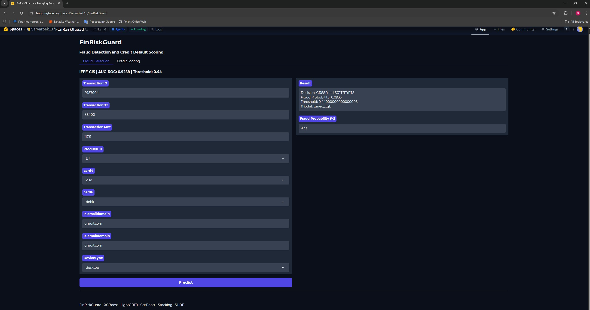

---

**Figure 11 — Gradio Credit Scoring (Hugging Face Spaces)**

The Credit Scoring tab on HF Spaces. Applicant: `SK_ID_CURR 100002`, `AMT_CREDIT 406,597.5`, `AMT_INCOME_TOTAL 202,500`, `DAYS_EMPLOYED -637` (actively employed), `EXT_SOURCE_1 0` (missing — encoded as elevated risk signal by the pipeline), `EXT_SOURCE_2 0.651`, `EXT_SOURCE_3 0.493`. Result: `Decision: GREEN — LOW RISK`, `Default Probability: 0.1229` (12.29%), `Model: stacking`, `Threshold: 0.50`.

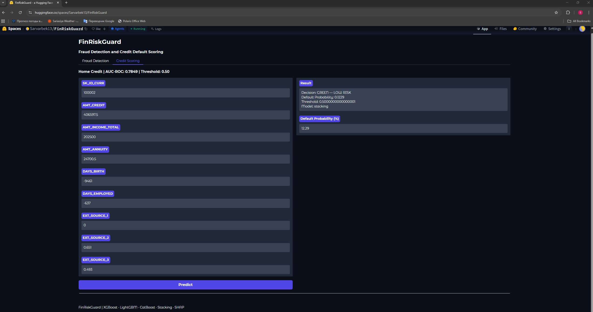

---

## Deployment Summary

| Component | Status | Details |
|-----------|--------|---------|
| FastAPI inference service | ✅ Live | `/predict`, `/batch`, `/metadata`, `/health` — all endpoints operational |
| Dockerized API | ✅ Live | `python:3.11-slim`, health check every 30s, 1 Uvicorn worker |
| Health-check endpoint | ✅ Live | `GET /health` → `{"status": "ok", "service": "FinRiskGuard API"}` |
| Batch prediction endpoint | ✅ Live | Up to 10,000 records per request for both models |
| Model metadata endpoint | ✅ Live | AUC-ROC, AUC-PR, F1, threshold, feature count |
| Threshold-based decision | ✅ Live | Fraud: 0.44, Credit: 0.50 — both at Recall ≥ 0.70 |
| GitHub Actions CI/CD | ✅ Live | Test → Build → Push → Deploy on every push to `main` |
| Docker Hub | ✅ Live | `shargun1303/finriskguard-api:latest`, `finriskguard-gradio:latest` |
| AWS S3 model storage | ✅ Live | `finriskguard-models` bucket — 36 MB fraud, 134 MB credit |
| AWS EC2 deployment | ✅ Live | `t3.micro`, Seoul (`ap-northeast-2`), both containers running |
| Gradio demo — HF Spaces | ✅ Live | [huggingface.co/spaces/Sarvarbek13/FinRiskGuard](https://huggingface.co/spaces/Sarvarbek13/FinRiskGuard) — permanent, free |
