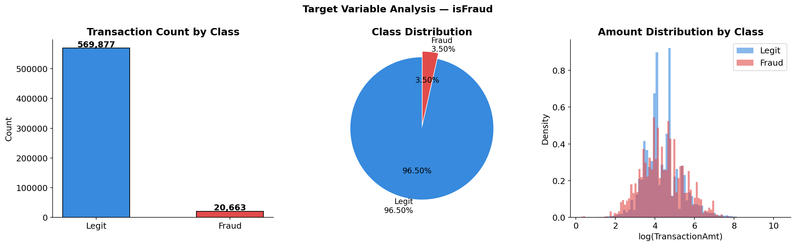
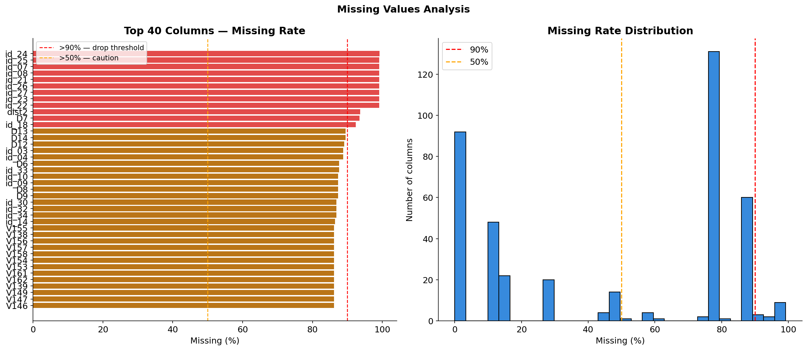
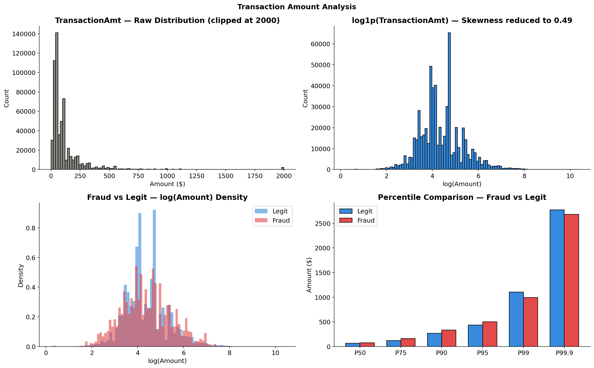
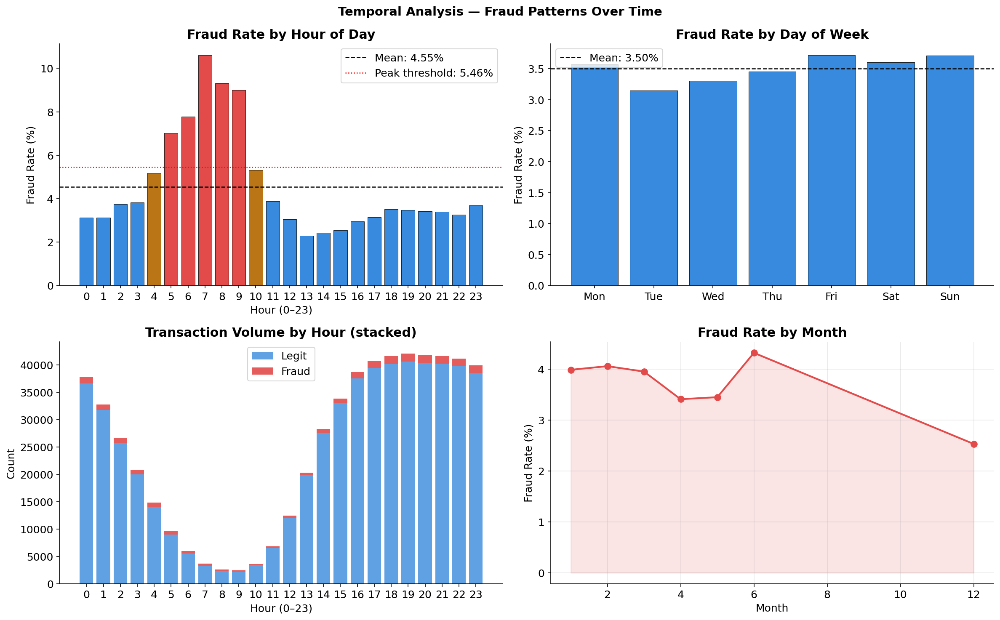
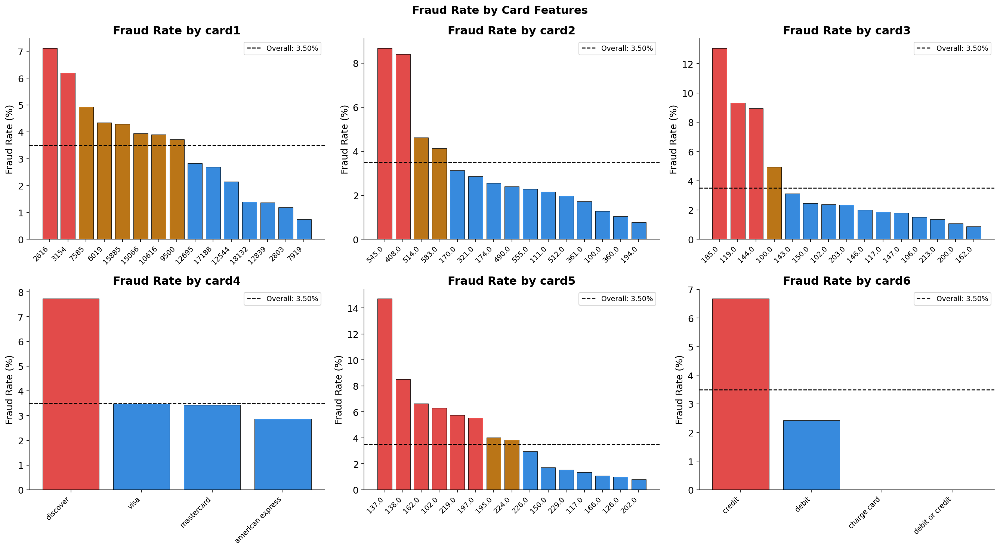
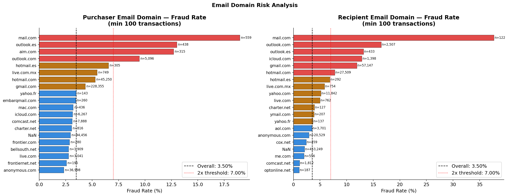
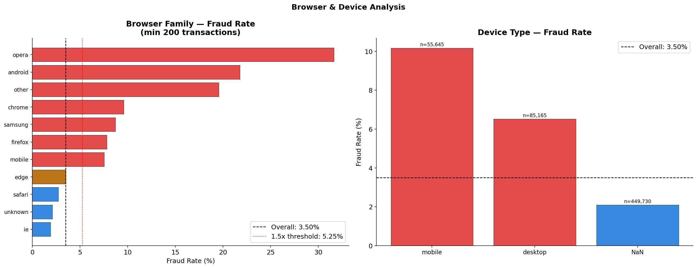
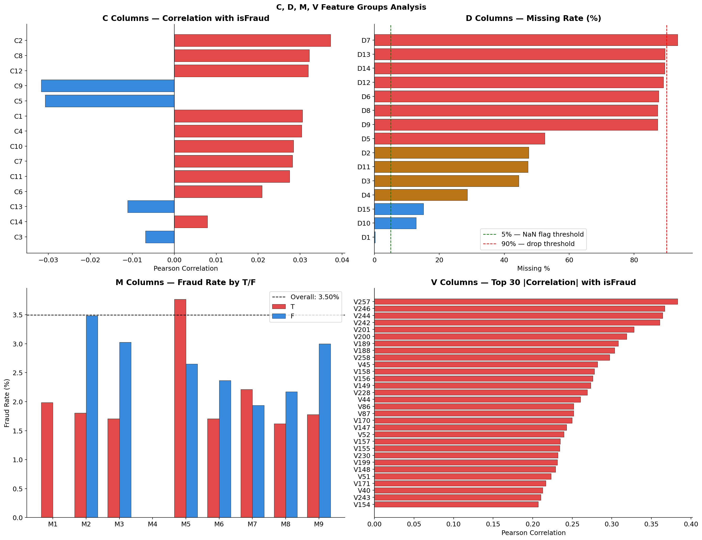
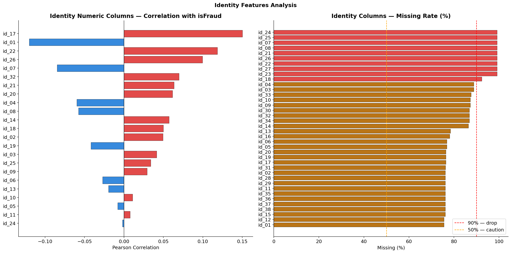
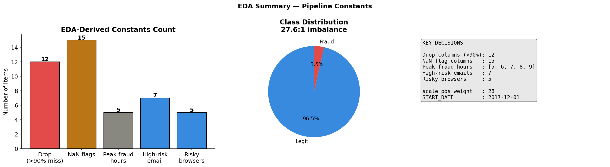

# 🔴 Fraud Detection — Exploratory Data Analysis

**Notebook:** `notebooks/01_eda_fraud.ipynb`  
**Purpose:** Understand dataset structure, fraud patterns, and derive all pipeline constants from data.

[← Back to README](../../README.md) | [→ Feature Engineering](03_feature_engineering.md)

---

## Dataset Overview

| | Value |
|---|---|
| Source | Vesta Corporation (IEEE-CIS Kaggle) |
| Transactions | 590,540 |
| Raw features | 434 (transaction + identity merged) |
| Date range | 2017-12-02 → 2018-06-01 (181 days) |
| Fraud count | 20,663 |
| Legit count | 569,877 |
| **Fraud rate** | **3.50%** |
| **Imbalance** | **27.6 : 1** |

---

## 1. Target Variable & Class Imbalance

**Problem:** 27.6:1 imbalance makes the minority class nearly invisible to standard models. A naive classifier predicting "all legit" achieves 96.5% accuracy — meaningless.

**Decision:** Explicit imbalance handling across all three model families:

```python
XGBoost  → scale_pos_weight = 28
LightGBM → is_unbalance = True
CatBoost → auto_class_weights = 'Balanced'
```



---

## 2. Missing Values

**Problem:** 434 raw features, many with >90% missing values — no signal, pure noise.

**Finding:**
- 12 columns exceed 90% missing → dropped entirely
- D columns: 50–85% missing, but pattern is **non-random** → NaN itself is a signal

**Decisions:**
- Drop: `['dist2', 'D7', 'id_07', 'id_08', 'id_18', 'id_21', 'id_22', 'id_23', 'id_24', 'id_25', 'id_26', 'id_27']`
- NaN flags for 15 D/dist columns: `dist1, D1–D6, D8–D15`



---

## 3. Transaction Amount

**Problem:** Raw `TransactionAmt` has skewness of **14.37** — extreme right tail dominated by large transactions.

**Finding:** Fraud transactions are not concentrated at high amounts — the distribution overlaps significantly with legit. Raw skewness hurts gradient boosting models.

**Decision:** `FE_amt_log = log1p(TransactionAmt)` → skewness reduced to **0.49**



---

## 4. Temporal Patterns

**Problem:** `TransactionDT` is raw seconds — no human-interpretable signal without decomposition.

**Finding:** Fraud rate spikes sharply at hours 5–9 AM — low transaction volume, high fraud concentration. Fraudsters operate when oversight is minimal.

| Hour window | Fraud rate | vs Overall |
|---|---|---|
| 5–9 AM (peak) | ~6–8% | 2–2.5× higher |
| Overall average | 3.50% | baseline |
| Business hours (9–18) | ~2.5–3% | below average |

**Decision:** `PEAK_FRAUD_HOURS = [5, 6, 7, 8, 9]` → `FE_is_peak_fraud_hour` binary feature



---

## 5. Card Features

**Finding:**
- `card6 = 'credit'` → **6.68%** fraud vs debit **2.43%** (2.75× higher)
- `card4 = 'discover'` → **7.73%** fraud (highest by network)
- `card1 + addr1` unique combinations → 39.5% are singletons → frequency encoding justified

**Decision:** Frequency encode `card1`, `card2`, `card4`, `card6`. Build `card1_addr1` fingerprint.



---

## 6. Email Domain Risk

**Problem:** 100+ email domains, many with low transaction counts — direct encoding causes overfitting.

**Finding:**
- `protonmail.com` → **~40% fraud rate** (privacy-focused, systematically used by fraudsters)
- Several domains exceed 2× overall fraud rate at sufficient volume

**Decisions:**
- `FE_P_email_is_proton` / `FE_R_email_is_proton` — binary proton flag
- `FE_P_email_high_risk` / `FE_R_email_high_risk` — binary high-risk domain flag
- Frequency encode both email domain columns



---

## 7. Browser & Device

**Finding:**
- Mobile devices → higher fraud rate than desktop
- Opera, Android browser, Samsung browser, Firefox, mobile variants → elevated fraud rates

**Decisions:**
```python
RISKY_BROWSERS = ['opera', 'android', 'samsung', 'firefox', 'mobile']
```
- `FE_browser_is_risky` — binary flag
- `FE_device_is_mobile` — binary flag



---

## 8. C, D, M, V Columns

**C columns (count features):**
- C5, C13 → highest correlation with isFraud
- High inter-column correlation → correlation filter will remove redundant ones

**D columns (time delta features):**
- 50–85% missing — but NaN pattern is non-random
- D columns drift with `TransactionDT` → raw D features will mislead models trained across time periods
- **Critical finding:** This drift is why D-column normalization is essential (→ Feature Engineering)

**M columns (binary match features):**
- M4 shows strongest signal: `M4='M2'` → **11.37% fraud rate**
- NaN in M columns → **5.28% fraud** (non-random missingness)

**V columns (Vesta proprietary):**
- 339 columns; top by |correlation|: V257, V246, V244
- High inter-column redundancy → feature selection will reduce this group heavily



---

## 9. Identity Features

**Context:** Identity table joins to only **~24%** of transactions (left join by TransactionID).

**Finding:**
- `id_15 = 'Found'` → **10.51%** fraud
- `id_35 = 'F'` → **12.26%** fraud (strongest categorical identity signal)
- `id_17` → strongest numeric identity correlation with isFraud
- 8 identity columns exceed 90% missing → dropped



---

## 10. EDA Conclusions — All Pipeline Constants

Every constant below is **derived from data** in this notebook and used consistently across all pipeline modules. Nothing is hardcoded by intuition.

```python
# Drop — no signal
DROP_HIGH_MISSING = [
    'id_24','id_25','id_07','id_08','id_21','id_26',
    'id_27','id_23','id_22','dist2','D7','id_18'
]  # 12 columns, all >90% missing

# NaN flags — missingness is signal
NAN_FLAG_COLS = [
    'dist1','D1','D2','D3','D4','D5',
    'D6','D8','D9','D10','D11','D12','D13','D14','D15'
]  # 15 columns

# Temporal
START_DATE       = pd.Timestamp('2017-12-01')
PEAK_FRAUD_HOURS = [5, 6, 7, 8, 9]

# Email risk
PROTON_DOMAINS          = ['protonmail.com', 'pm.me']
HIGH_RISK_EMAIL_DOMAINS = ['mail.com','outlook.es','aim.com',
                            'outlook.com','icloud.com']

# Browser/device risk
RISKY_BROWSERS = ['opera', 'android', 'samsung', 'firefox', 'mobile']

# Imbalance
SCALE_POS_WEIGHT = 28  # XGBoost
```



---

[← Back to README](../../README.md) | [→ Feature Engineering](03_feature_engineering.md)