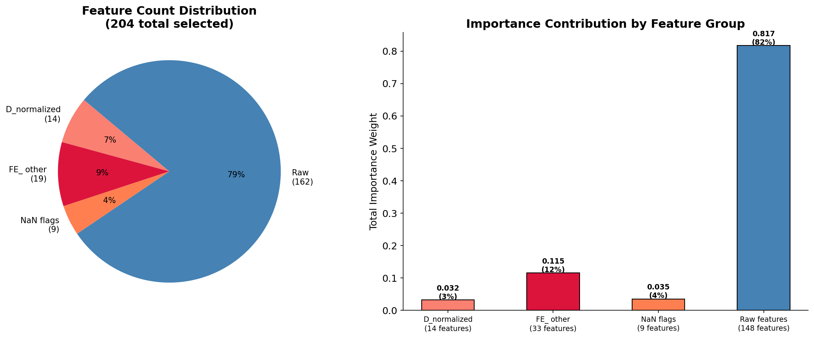

# 🔴 Fraud Detection — Feature Engineering

**Source:** `src/features/ieee_cis/feature_engineer.py`  
**Pipeline:** `src/pipelines/fraud_pipeline.py` — Stage 3 (runs BEFORE preprocessing)

[← EDA](01_eda.md) | [← Back to README](../../README.md) | [→ Preprocessing](03_preprocessing.md)

---

## Why Feature Engineering Runs Before Preprocessing

**Problem:** OrdinalEncoder in preprocessing converts string columns to integers. Feature engineering reads raw string columns — `id_31` (browser), `DeviceType`, `P_emaildomain`, `R_emaildomain`. If preprocessing ran first, these columns would be destroyed before FE could use them.

**Decision:** FE → Preprocessing order is enforced in `fraud_pipeline.py`. This ordering is documented as a hard rule, not a convention.

```
STAGE 3: Feature Engineering
  Order  : FE FIRST → Preprocessing SECOND
  Reason : FE needs raw string columns
```

---

## Results

| | Train | Val | Test |
|---|---|---|---|
| Input shape | (472,432 × 434) | (118,108 × 434) | (506,691 × 433) |
| Output shape | (472,432 × 483) | (118,108 × 483) | (506,691 × 481) |
| **FE features created** | **47** | 47 applied | 46 applied |

---

## 1. Transaction Amount — Log Transformation

**Problem (from EDA):** Raw `TransactionAmt` skewness = **16.43** — extreme right tail corrupts gradient boosting splits.

**Solution:**
```python
FE_amt_log = np.log1p(TransactionAmt)
```

**Result (from log):**
```
Skewness: 16.43 → 0.50  (train)
Skewness:  6.91 → 0.46  (val)
Skewness:  8.60 → 0.39  (test)
```

---

## 2. Temporal Features

**Problem (from EDA):** `TransactionDT` is raw seconds — no model can learn "hour of day" or "day of week" from a raw integer.

**Solution:**
```python
START_DATE = pd.Timestamp('2017-12-01')  # consistent across all modules

FE_hour               = hour of day (0–23)
FE_dayofweek          = day of week (0=Mon, 6=Sun)
FE_day                = day of month
FE_month              = month
FE_is_night           = 1 if hour in [0,1,2,3,4,22,23]
FE_is_weekend         = 1 if dayofweek in [5,6]
FE_is_peak_fraud_hour = 1 if hour in [5,6,7,8,9]
```

`PEAK_FRAUD_HOURS = [5, 6, 7, 8, 9]` — derived from EDA, hardcoded constant.

---

## 3. D-Column Normalization — Critical Decision

**Problem (from EDA):** D columns encode "days since last event" (last login, last purchase, etc). They drift linearly with `TransactionDT` — a D1 value of 100 means something different in December vs June. Raw D columns mislead models trained on historical data and applied to future transactions.

**Proof of drift:**
```
Transaction on day 100 with D1=90  → "last event 10 days ago"
Transaction on day 400 with D1=390 → "last event 10 days ago"
Raw D1 values: 90 vs 390 — model sees completely different numbers
for the same client behavior
```

**Solution:**
```python
# TransactionDT_days = TransactionDT / 86400 (seconds → days)
FE_D{n}_normalized = D{n} - TransactionDT_days
```

This removes time drift. Both transactions above now produce `FE_D1_normalized = -10` — the model sees the same client behavior regardless of when the transaction occurred.

**14 normalized features created:**
```
FE_D1_normalized, FE_D2_normalized, FE_D3_normalized, FE_D4_normalized,
FE_D5_normalized, FE_D6_normalized, FE_D8_normalized, FE_D9_normalized,
FE_D10_normalized, FE_D11_normalized, FE_D12_normalized, FE_D13_normalized,
FE_D14_normalized, FE_D15_normalized
```

> **Note:** Correlation filter in Feature Selection drops these (corr > 0.95 with raw D columns). They are **force-included** after selection. SHAP analysis confirmed their importance in the final model.



---

## 4. Card Combination Fingerprints

**Problem (from EDA):** `card1` alone has thousands of unique values. `card1 + addr1` creates a more specific cardholder fingerprint. 39.5% of `card1_addr1` combinations are singletons — frequency encoding captures rarity.

**Solution:**
```python
card1_addr1 = card1.astype(str) + '_' + addr1.astype(str)
card_full   = card1 + '_' + card2 + '_' + card3 + '_' + card5
```

These intermediate columns are then frequency-encoded (see below).

---

## 5. UID Features — Cardholder Identity

**Problem:** No explicit cardholder ID in the dataset. Fraudsters reuse card+address combinations across transactions.

**Solution:** Build proxy UIDs from card and address combinations:
```python
FE_uid     = card1 + '_' + addr1 + '_' + P_emaildomain
FE_uid_ext = card1 + '_' + addr1 + '_' + P_emaildomain + '_' + DeviceType
```

Then frequency-encoded to capture how often each identity fingerprint appears in train.

---

## 6. Email Domain Risk Flags

**Problem (from EDA):** `protonmail.com` has ~40% fraud rate. Several domains exceed 2× overall fraud rate. Direct encoding of 100+ domains causes overfitting.

**Solution:**
```python
FE_P_email_is_proton  = 1 if P_emaildomain in ['protonmail.com', 'pm.me']
FE_P_email_high_risk  = 1 if P_emaildomain in HIGH_RISK_EMAIL_DOMAINS
FE_R_email_is_proton  = 1 if R_emaildomain in ['protonmail.com', 'pm.me']
FE_R_email_high_risk  = 1 if R_emaildomain in HIGH_RISK_EMAIL_DOMAINS
FE_email_match        = 1 if P_emaildomain == R_emaildomain
```

---

## 7. Browser & Device Risk Flags

**Problem (from EDA):** Opera, Android, Samsung, Firefox mobile variants show elevated fraud rates. Mobile transactions have higher fraud rate than desktop.

**Solution:**
```python
RISKY_BROWSERS = ['opera', 'android', 'samsung', 'firefox', 'mobile']

FE_browser_is_risky = 1 if any risky keyword in id_31.lower()
FE_device_is_mobile = 1 if DeviceType == 'mobile'
```

**From log:**
```
Risky transactions (train) : 49,540  (10.49%)
Mobile transactions (train): 46,093  ( 9.76%)
```

---

## 8. Card Aggregations

**Problem:** A card used for 500 transactions with avg $50 behaves very differently from one used 3 times with avg $500. The model needs this behavioral context.

**Solution:** Aggregate `TransactionAmt` by `card1` and `card1_addr1`:
```python
FE_card1_amt_mean    FE_card1_amt_std    FE_card1_amt_count
FE_card1a1_amt_mean  FE_card1a1_amt_std  FE_card1a1_amt_count
```

Train: computed from train only. Val/test: apply saved aggregation maps.

---

## 9. Frequency Encoding

**Problem:** High-cardinality categoricals (`card1`, `card2`, `addr1`, email domains, UIDs) — OrdinalEncoder assigns arbitrary integers that carry no signal.

**Solution:** Replace each category with its frequency in the training set:
```python
# 9 columns frequency-encoded:
FE_card1_freq          FE_card2_freq          FE_addr1_freq
FE_P_emaildomain_freq  FE_R_emaildomain_freq  FE_card1_addr1_freq
FE_card_full_freq      FE_uid_freq            FE_uid_ext_freq
```

Rare/unseen categories in val/test → mapped to 0.

---

## All 47 Engineered Features

| Group | Features |
|---|---|
| Amount | `FE_amt_log` |
| Temporal | `FE_hour`, `FE_dayofweek`, `FE_day`, `FE_month`, `FE_is_night`, `FE_is_weekend`, `FE_is_peak_fraud_hour` |
| D-normalized | `FE_D1_normalized` → `FE_D15_normalized` (14 features, D7 excluded) |
| UID | `FE_uid`, `FE_uid_ext` |
| Email risk | `FE_P_email_is_proton`, `FE_P_email_high_risk`, `FE_R_email_is_proton`, `FE_R_email_high_risk`, `FE_email_match` |
| Browser/Device | `FE_browser_is_risky`, `FE_device_is_mobile` |
| Card aggregations | `FE_card1_amt_mean`, `FE_card1_amt_std`, `FE_card1_amt_count`, `FE_card1a1_amt_mean`, `FE_card1a1_amt_std`, `FE_card1a1_amt_count` |
| Frequency encoding | `FE_card1_freq`, `FE_card2_freq`, `FE_addr1_freq`, `FE_P_emaildomain_freq`, `FE_R_emaildomain_freq`, `FE_card1_addr1_freq`, `FE_card_full_freq`, `FE_uid_freq`, `FE_uid_ext_freq`, `FE_card1_addr1_count` |

---

[← EDA](01_eda.md) | [← Back to README](../../README.md) | [→ Preprocessing](03_preprocessing.md)