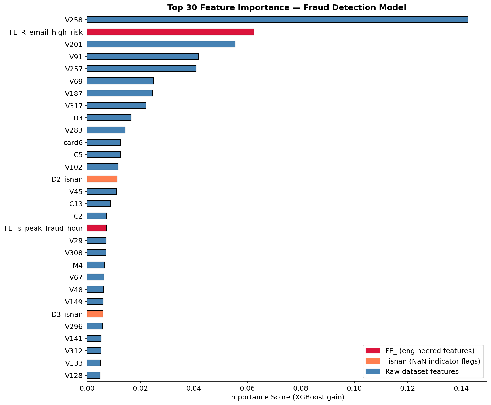

# 🔴 Fraud Detection — Feature Selection

**Source:** `src/features/ieee_cis/feature_selector.py`  
**Pipeline:** `src/pipelines/fraud_pipeline.py` — Stage 5

[← Preprocessing](03_preprocessing.md) | [← Back to README](../../README.md) | [→ Leakage Audit](05_leakage.md)

---

## Overview

478 columns after preprocessing → **204 final features** for training.

Three-step process:
```
Step 1: Correlation filter (threshold=0.95)  → 478 → 398 cols
Step 2: MI + XGB dual selection (top_k=200)  → rank-based 200
Step 3: D_normalized force-include           → 200 → 204 final
```

Runtime: ~22 minutes (MI: ~18 min · XGB: ~17 sec · on 472K rows)

---

## Step 1 — Correlation Filter

**Problem:** Many features are near-perfectly correlated — identical information carried by multiple columns increases noise and slows training.

**Solution:** Remove one of each pair with correlation > 0.95:

```
Correlation filter: threshold = 0.95
Dropped 80 correlated features
Sample dropped : ['C6', 'C7', 'C10', 'C11', 'C14']
Remaining cols : 398
```

> **Side effect:** D_normalized features also get dropped here (corr > 0.95 with raw D columns). This is corrected in Step 3.

---

## Step 2 — Dual Selection: MI + XGB Rank

**Problem:** Single-method feature selection is unreliable. MI captures non-linear statistical dependencies but ignores feature interactions. XGBoost importance captures interaction effects but is biased toward high-cardinality features.

**Solution:** Run both independently, combine via average rank:

### Mutual Information (top_k=200)

```
MI selection: top_k = 200
Top 5 MI features : ['addr2', 'V109', 'V247', 'V245', 'V250']
MI score range    : 0.1426 → 0.0139
Selected          : 200 features
```

### XGBoost Importance (top_k=200)

```python
XGBClassifier(
    n_estimators=200,
    scale_pos_weight=28,   # class imbalance ratio from EDA
    tree_method='hist',
    eval_metric='auc',
)

Top 5 XGB features : ['V258', 'V69', 'V317', 'D3', 'V187']
Importance range   : 0.1067 → 0.001208
Selected           : 200 features
```

### Rank-Based Combination

```
MI selected      : 200
XGB selected     : 200
Union            : 296
Intersection     : 104
MI∩XGB overlap   : 52.0% of MI selected

→ Rank-based top-200 selected (avg of MI rank + XGB rank)
```

### Top 30 Features by Average Rank

| Feature | MI score | XGB importance | MI rank | XGB rank | Avg rank |
|---|---|---|---|---|---|
| V201 | 0.1090 | 0.0157 | 39 | 8 | 23.5 |
| V149 | 0.1347 | 0.0044 | 10 | 37 | 23.5 |
| V67 | 0.1257 | 0.0047 | 18 | 35 | 26.5 |
| V258 | 0.0866 | 0.1067 | 92 | 1 | 46.5 |
| card6 | 0.0921 | 0.0111 | 80 | 15 | 47.5 |
| **D6_isnan** | 0.0934 | 0.0038 | 72 | 41 | 56.5 |
| **D2_isnan** | 0.0691 | 0.0164 | 134 | 7 | 70.5 |
| **FE_D9_normalized** | 0.1082 | 0.0020 | 41 | 113 | 77.0 |
| **D5_isnan** | 0.0787 | 0.0033 | 112 | 54 | 83.0 |
| **D3_isnan** | 0.0608 | 0.0051 | 140 | 31 | 85.5 |

NaN flags (`D6_isnan`, `D2_isnan`, `D5_isnan`, `D3_isnan`) and engineered features (`FE_D9_normalized`) appear in top 30 — confirming EDA decisions.

---

## Step 3 — D_normalized Force-Include

**Problem:** Correlation filter dropped D_normalized features (corr > 0.95 with raw D columns). But these features are critical — they carry client-stable temporal signal that raw D columns lack (see Feature Engineering).

**Solution:** After rank selection, force-include all D_normalized features:

```
Force-included 4 D_normalized features
(dropped by correlation filter):
['FE_D1_normalized', 'FE_D10_normalized',
 'FE_D14_normalized', 'FE_D15_normalized']
```

> The other 10 D_normalized features (`FE_D2` through `FE_D9`, etc.) survived the correlation filter and were already selected by rank. Only 4 needed force-inclusion.

SHAP analysis later confirmed all 14 D_normalized features are important in the final model.

---

## Final Selection — 204 Features

```
FE_ engineered  : 33  (of which D_normalized: 14)
_isnan flags    : 9
Raw features    : 162
─────────────────────
TOTAL           : 204
```

| Split | Shape |
|---|---|
| Train | 472,432 × 205 (204 features + target) |
| Val | 118,108 × 205 |
| Test | 506,691 × 196 (8 identity cols absent in test CSV) |

Saved to `data/features/fraud/`:
- `train_fraud_features.parquet`
- `val_fraud_features.parquet`
- `test_fraud_features.parquet`



---

## Why top_k Was Raised from 150 → 200

Original top_k was 150. Raised to 200 for three reasons:
1. 14 new D_normalized features need space in the selection pool
2. Extended UID and card1_addr1 aggregations added more FE features
3. Competitive Kaggle solutions use 250–300+ features on this dataset

Rank mode picks best 200 by avg MI+XGB rank — raising top_k does not blindly add noise, only features that rank well on both metrics enter.

---

[← Preprocessing](03_preprocessing.md) | [← Back to README](../../README.md) | [→ Leakage Audit](05_leakage.md)