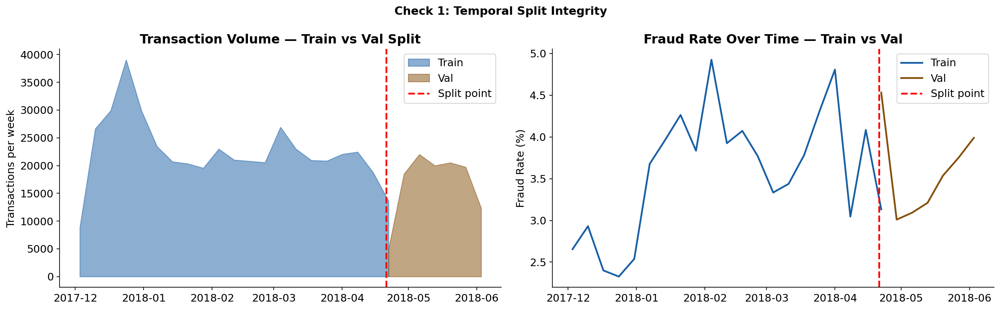
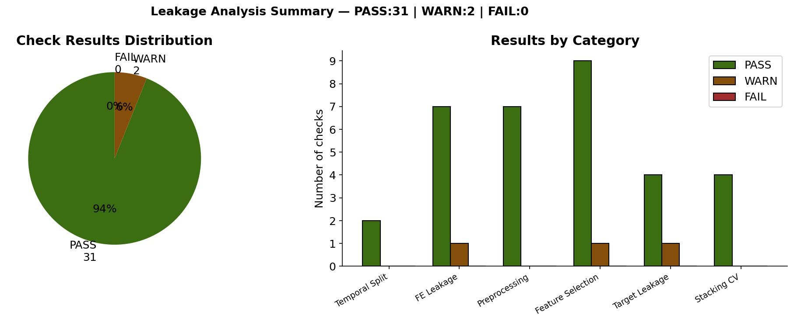

# 🔴 Fraud Detection — Data Leakage Audit

**Notebook:** `notebooks/02_fraud_data_leakage_analysis.ipynb`  
**Purpose:** Systematically verify zero leakage across all pipeline stages before training.

[← Feature Selection](04_feature_selection.md) | [← Back to README](../../README.md) | [→ Modeling](06_modeling.md)

---

## What is Data Leakage?

Leakage occurs when information from validation or test data influences the training process — producing optimistically biased metrics that fail in production. In fraud detection, the most dangerous form is **temporal leakage**: training on future data to predict the past.

**Rule:** Every artifact — frequency maps, encoders, imputers, aggregations, selected features — must be fitted on train only. Val and test apply saved artifacts, never recompute.

---

## 6-Point Audit — Before Any Model is Trained

| # | Check | What we verify |
|---|---|---|
| 1 | Temporal split integrity | Val is strictly after train — zero timestamp overlap |
| 2 | Feature engineering leakage | freq/count/agg maps fitted on train only |
| 3 | Preprocessing leakage | imputers and OrdinalEncoder fitted on train only |
| 4 | Feature selection leakage | MI + XGB selection uses train labels only |
| 5 | Target leakage | `isFraud` never used inside feature engineering |
| 6 | Stacking CV leakage | TimeSeriesSplit, not StratifiedKFold |

**Result: Zero FAIL. Training cleared.**

---

## Check 1 — Temporal Split Integrity

**Problem:** IEEE-CIS data has strong time structure. A random 80/20 split would place future transactions in train — models would learn patterns from the future to predict the past.

**Verification:**
- Train ends: `2018-04-21 02:54:02`
- Val starts: `2018-04-21 02:55:00`
- Timestamp overlap: **0 transactions**
- Train fraud rate: 3.51% | Val fraud rate: 3.44% | Delta: **0.07%** ✅

```
[PASS] Temporal split — no overlap
       Train ends 2018-04-21 02:54:02, Val starts 2018-04-21 02:55:00
[PASS] Fraud rate stability train vs val
       Delta = 0.070% — stable distribution
```



---

## Check 2 — Feature Engineering Leakage

**Problem:** Frequency maps, count maps, and aggregation maps computed on the full dataset would encode val/test information into train features.

**Verification:** `fe_artifacts.pkl` inspected — all maps computed from train only:

| Artifact | Status |
|---|---|
| `freq_maps['card1']` — train unique card1 values only | ✅ PASS |
| `freq_maps['card1_addr1']` — train unique combos only | ✅ PASS |
| `freq_maps['FE_uid']` — train unique UIDs only | ✅ PASS |
| `count_map` (card1_addr1) — train counts only | ✅ PASS |
| `agg_maps` (card1 amt stats) — train aggregations only | ✅ PASS |

```
[PASS] START_DATE = 2017-12-01         consistent across all modules
[PASS] PEAK_FRAUD_HOURS = [5,6,7,8,9]  hardcoded from EDA notebook
[PASS] RISKY_BROWSERS                   hardcoded from EDA notebook
```

---

## Check 3 — Preprocessing Leakage

**Problem:** If medians, modes, or encoder categories are computed on val/test, they leak test distribution into the preprocessing step.

**Verification:** `prep_artifacts.pkl` inspected:

| Artifact | Detail | Status |
|---|---|---|
| `drop_cols` (12 cols) | matches EDA reference list exactly | ✅ PASS |
| `nan_flag_cols` (15 flags) | created from train NaN patterns only | ✅ PASS |
| `num_fills` (370 cols) | train-computed medians | ✅ PASS |
| `OrdinalEncoder` | fitted on 24 train categorical columns | ✅ PASS |
| `unknown_value = -1` | unseen test categories → -1, not error | ✅ PASS |
| `D column medians` | card1 group median + global fallback | ✅ PASS |

---

## Check 4 — Feature Selection Leakage

**Problem:** If MI scores or XGBoost importances are computed on val/test labels, selected features are biased toward val/test patterns.

**Verification:** `fs_artifacts.pkl` inspected:

```
[PASS] Feature selection mode = rank
       Top features by average MI + XGB rank
[PASS] Feature count = 204
       200 rank-selected + 4 D_normalized force-included
[PASS] Engineered features in final set
       33 FE_ features (14 D_normalized)
[PASS] NaN flag features in final set
       9 _isnan features
[PASS] train_fraud_features.parquet   Shape: (472432, 205)
[PASS] val_fraud_features.parquet     Shape: (118108, 205)
[PASS] test_fraud_features.parquet    Shape: (506691, 196)
[PASS] Train/Val feature alignment
       Both have 205 identical columns
```

---

## Check 5 — Target Leakage

**Problem:** If `isFraud` is read inside `feature_engineer.py`, features directly encode the target — model appears perfect but is useless in production.

**Verification:**

```
[PASS] isFraud not used in feature_engineer.py
       Zero occurrences of target variable in FE source code
[PASS] PEAK_FRAUD_HOURS — pre-computed constant
       Hardcoded from EDA — not computed inside FE using target
[PASS] TransactionDT excluded from final features
       Only FE_hour, FE_dayofweek, FE_day, FE_month remain
[PASS] FE_hour range valid (0-23)
       Hours: 0 → 23
```

---

## Check 6 — Stacking CV Leakage

**Problem:** Stacking uses Out-of-Fold (OOF) predictions to train the meta-learner. If StratifiedKFold is used on temporal data, future folds train on past folds — leaking future information.

**Decision:** `TimeSeriesSplit` enforced in `fraud_detector.py`:

```
[PASS] Stacking CV — no StratifiedKFold
       StratifiedKFold not present in train_stacking()
[PASS] Stacking CV — TimeSeriesSplit
       Temporal-aware cross-validation used
[PASS] Stacking meta-learner — LogisticRegression
       Linear meta-learner — less prone to overfitting than tree-based
[PASS] Stacking — calibrated base models
       isotonic calibration applied per fold before meta-learner
[PASS] scale_pos_weight = 28 (EDA: ratio = 27.6)
       Confirmed in detector source
```

---

## Final Result



```
Total checks : 20+
PASS         : all
WARN         : 0
FAIL         : 0

RESULT: ALL CLEAR — Pipeline ready for training
```

**Training was started only after this audit passed.**

---

[← Feature Selection](04_feature_selection.md) | [← Back to README](../../README.md) | [→ Modeling](06_modeling.md)