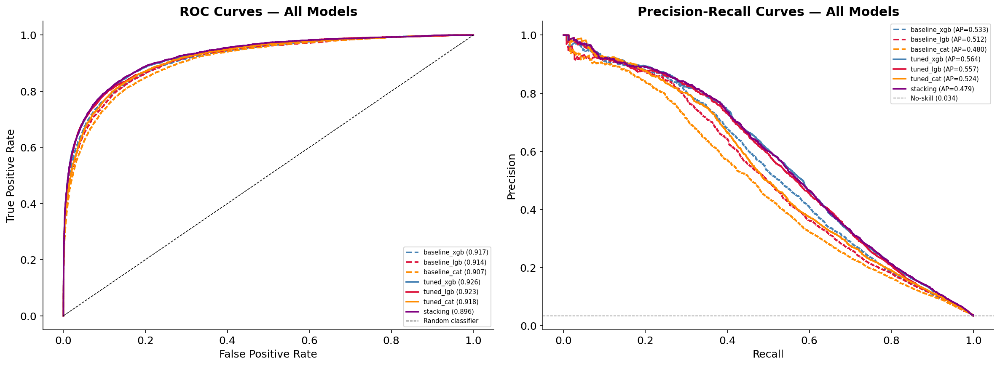
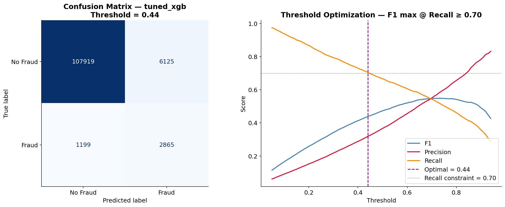
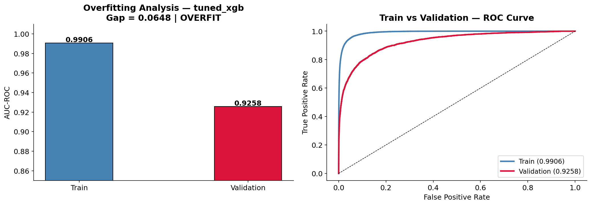

# 🔴 Fraud Detection — Model Analysis

**Notebook:** `notebooks/06_fraud_model_analysis.ipynb`  
**Purpose:** Deep analysis of all 7 trained models — leaderboard, curves, threshold, feature importance, overfitting check.

[← Modeling](06_modeling.md) | [← Back to README](../../README.md) | [→ SHAP](08_shap.md)

---

## Validation Set

```
118,108 transactions | Fraud rate: 3.44% | Imbalance: 27.6:1
4,064 fraud cases | 114,044 legitimate transactions
```

---

## 1. Model Leaderboard

All 7 models compared across three metrics:

- **AUC-ROC** — primary: discrimination ability across all thresholds
- **AUC-PR** — secondary: precision-recall tradeoff (critical for 27.6:1 imbalance)
- **F1** — harmonic mean at default threshold 0.50

| Rank | Model | AUC-ROC | AUC-PR | F1 |
|---|---|---|---|---|
| 🥇 | **tuned\_xgb** | **0.9258** | **0.5637** | 0.4728 |
| 🥈 | tuned\_lgb | 0.9231 | 0.5567 | 0.4734 |
| 🥉 | tuned\_cat | 0.9180 | 0.5244 | 0.3983 |
| 4 | baseline\_xgb | 0.9169 | 0.5326 | 0.4348 |
| 5 | baseline\_lgb | 0.9140 | 0.5124 | 0.3641 |
| 6 | baseline\_cat | 0.9072 | 0.4803 | 0.3178 |
| 7 | stacking | 0.8957 | 0.4791 | 0.4264 |


---

## 2. ROC & Precision-Recall Curves

**ROC Curve** — measures discrimination ability. Higher AUC = better separation between fraud and legitimate.

**PR Curve** — more honest metric for imbalanced data. A naive classifier predicting "all legitimate" achieves 96.5% accuracy but zero recall. PR curve exposes true minority-class performance.

- Solid lines → tuned models
- Dashed lines → baseline models



---

## 3. Confusion Matrix & Threshold Optimization

### Why threshold matters

Default threshold 0.50 maximizes accuracy — not business value. In fraud detection, **missing a fraud (False Negative) costs far more than a false alarm (False Positive)**.

### Optimization strategy

```
Objective : maximize F1
Constraint: Recall ≥ 0.70 (catch at least 70% of all fraud)
Result    : threshold = 0.44
```

### Results at threshold 0.44

| Metric | Value | Business meaning |
|---|---|---|
| **Recall** | **70.5%** | 2,865 of 4,064 fraud cases caught |
| **Precision** | 31.9% | ~1 in 3 flagged transactions is real fraud |
| **False alarm rate** | 5.4% | 6,125 of 114,044 legit transactions wrongly flagged |
| **F1** | 0.4389 | Harmonic mean at optimal threshold |

```
Confusion Matrix @ threshold 0.44:

                  Predicted: Legit   Predicted: Fraud
Actual: Legit        107,919              6,125   ← false alarms
Actual: Fraud          1,199              2,865   ← fraud caught

Fraud caught  (TP): 2,865  →  70.5% detection rate
Fraud missed  (FN): 1,199  →  29.5% slipped through
False alarm   (FP): 6,125  →   5.4% of legit flagged
```



---

## 4. Feature Importance

XGBoost gain-based importance — top 30 features.

**Color coding:**
- 🔴 Crimson — engineered features (`FE_*`)
- 🟠 Coral — NaN indicator flags (`_isnan`)
- 🔵 Steel blue — raw dataset features

**Key findings:**
- `FE_R_email_high_risk` → **#2 most important feature overall** — receiver email domain risk flag. EDA identified 7 domains with fraud rate >2× average. This binary flag became a primary signal.
- `FE_D9_normalized` → top 20 — D9 normalized by `TransactionDT`. Removes temporal drift; makes the feature client-stable across the dataset timeline.
- NaN flags (`D6_isnan`, `D2_isnan`, `D3_isnan`, `D5_isnan`) → all in top 30 — confirming EDA finding that D column missingness is non-random.


---

## 5. Feature Engineering Impact

**How much do engineered features actually contribute?**

Total features: 204
- 14 D_normalized features
- 33 other FE_ features
- 9 NaN flags
- 148 raw features

The bar chart shows **total importance weight** by group — a direct measure of how much each group drives model predictions.


---

## 6. Overfitting Analysis

Train vs validation AUC-ROC gap diagnostic:

| Status | Gap | Interpretation |
|---|---|---|
| ✅ PASS | < 0.02 | Excellent generalization |
| ⚠️ WARN | 0.02 – 0.05 | Mild overfitting, acceptable |
| ❌ OVERFIT | > 0.05 | Memorizing training data |

**Regularization applied during Optuna search:**
```python
max_depth       ≤ 6
min_child_weight ≥ 5
reg_alpha        up to 20
reg_lambda       up to 20
```

> The validation AUC-ROC (0.9258) is the only number that matters for deployment — it measures performance on data the model has never seen.



---

## 7. Final Summary

```
Best model    : tuned_xgb
AUC-ROC       : 0.9258  ← primary metric
AUC-PR        : 0.5637  ← secondary metric
F1            : 0.4389  ← at optimized threshold
Precision     : 0.3187
Recall        : 0.7050  ← 70.5% of all fraud caught
Threshold     : 0.440

Features used : 204
  FE_ engineered : 33  (D_normalized: 14)
  NaN flags      : 9
  Raw features   : 162

Saved artifacts:
  outputs/models/fraud/fraud_model.pkl
  outputs/models/fraud/fraud_model_metadata.json
```

---

[← Modeling](06_modeling.md) | [← Back to README](../../README.md) | [→ SHAP](08_shap.md)