# 🔴 Fraud Detection — SHAP Explainability

**Source:** `src/explainability/shap_explainer.py`  
**Notebook:** `notebooks/07_fraud_shap_analysis.ipynb`  
**Model:** tuned_xgb (TreeExplainer) | 2,000 samples | 204 features

[← Model Analysis](07_model_analysis.md) | [← Back to README](../../README.md)

---

## What is SHAP?

SHAP (SHapley Additive exPlanations) assigns each feature a contribution value for every prediction. Unlike feature importance (which is global and aggregate), SHAP explains **why the model made each specific decision**.

```
Base value        : 0.2931  (average fraud probability across val set)
SHAP values shape : (2000, 204)

For any transaction:
  P(fraud) = base_value + sum(SHAP contributions of all features)
```

---

## 1. Global SHAP — Bar Plot

Mean absolute SHAP value per feature — overall importance across 2,000 val set samples.

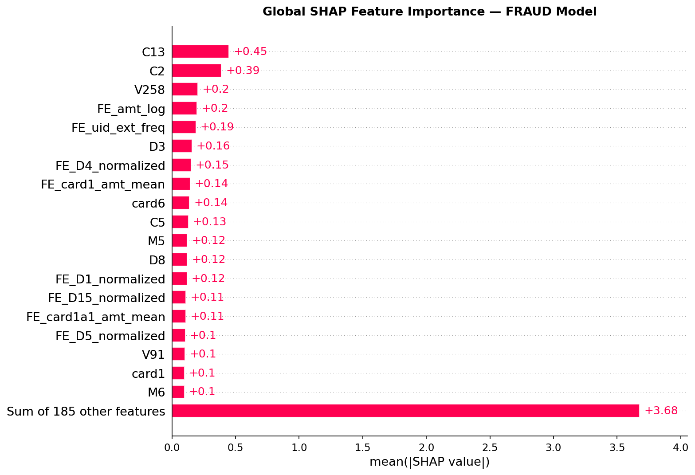

---

## 2. Global SHAP — Beeswarm Plot

Each dot = one transaction. X-axis = SHAP value (impact on fraud probability). Color = feature value (red=high, blue=low).

This reveals **direction of impact**: does a high value of this feature increase or decrease fraud probability?

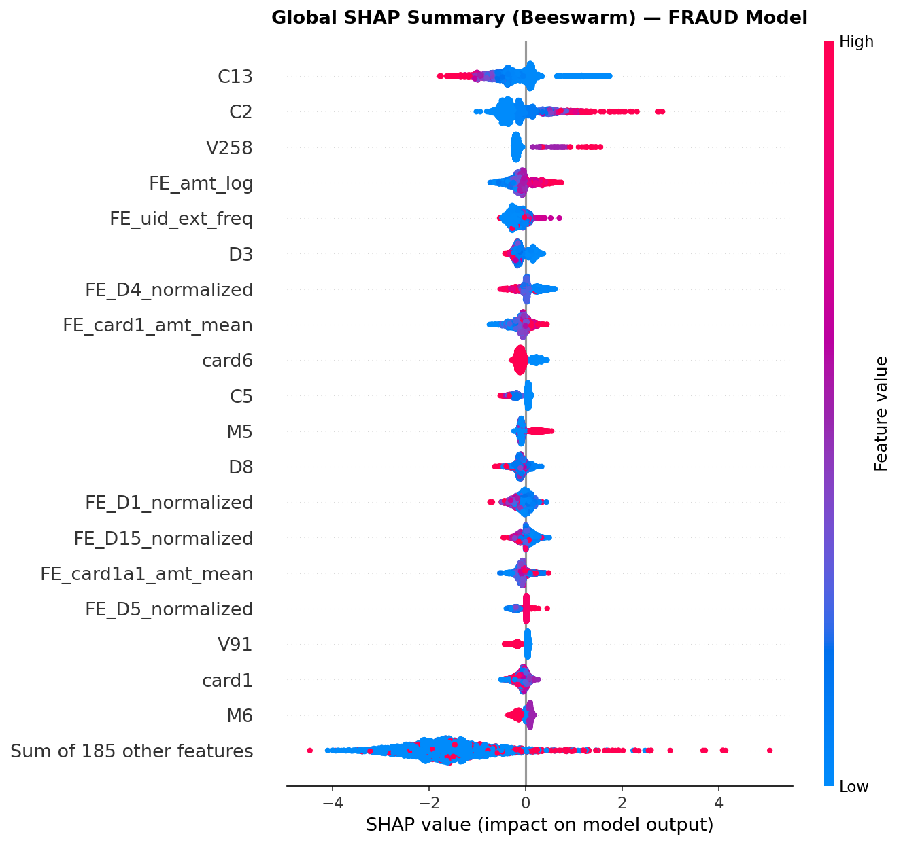

---

## 3. Global SHAP — Heatmap

Feature × sample heatmap showing SHAP values across all 2,000 samples. Reveals which features drive predictions for which types of transactions.

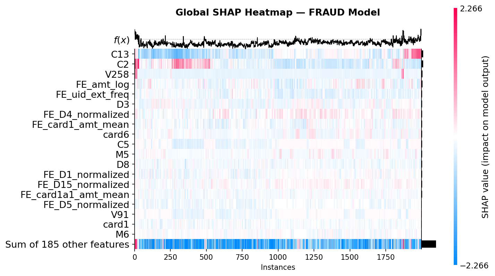

---

## 4. Mean |SHAP| — Custom Bar

Top features ranked by mean absolute SHAP — color-coded by feature type:
- 🔴 Crimson — engineered features (`FE_*`)
- 🟠 Coral — NaN flags (`_isnan`)
- 🔵 Steel blue — raw features

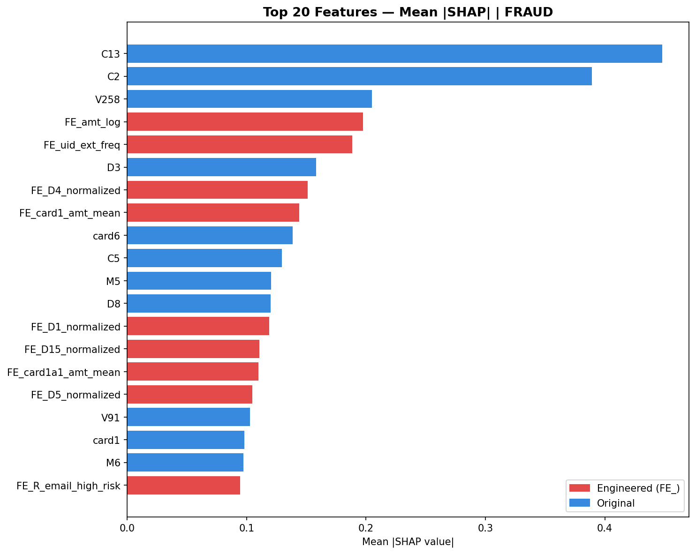

---

## 5. Positive vs Negative SHAP Split

For each top feature: how much SHAP weight pushes toward fraud (positive) vs away from fraud (negative). Reveals asymmetric behavior — some features are strongly one-directional.

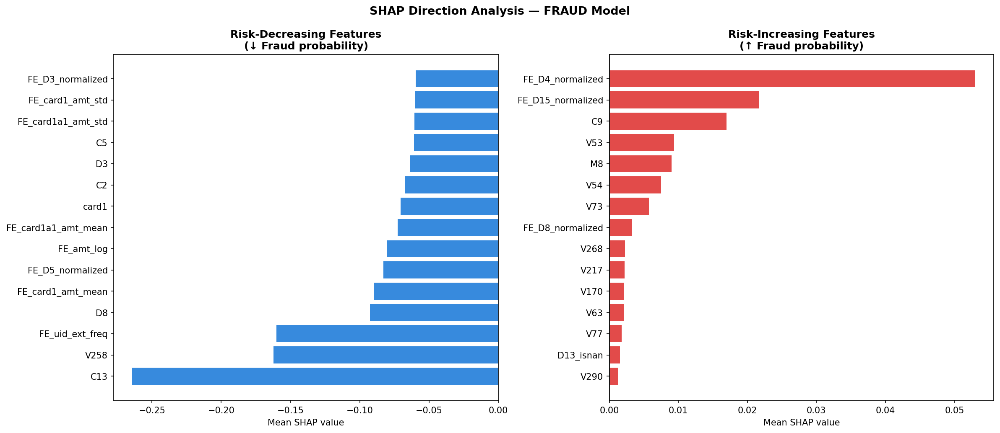

---

## 6. FE vs Raw Contribution

**Key question:** Did feature engineering actually help, or did raw features carry most of the signal?

```
FE features contribution  : 2.3410  (34.4%)
Raw features contribution : 4.4679  (65.6%)
```

**Interpretation:** Raw Vesta V/C columns carry majority signal — they encode proprietary behavioral patterns that are hard to replicate. Engineered features contribute **34.4%** of total SHAP weight despite being only 16% of features (33/204) — confirming they are high-signal additions.

D_normalized features (`FE_D4_normalized`, `FE_D8_normalized`) appear directly in the top 10 fraud case contributors — confirming the temporal drift correction was essential.

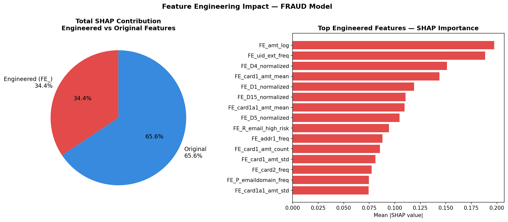

---

## 7. Local Explanation — High-Risk Fraud Case

Single transaction explanation for the highest-confidence fraud case in the validation set.

```
Base value (avg fraud prob) : 0.2931
SHAP prediction             : 9.1270  ← extremely high fraud signal
Model probability           : ~1.000

Top 10 risk factors:
  C2                    +2.4935  ↑ Fraud   (transaction count pattern)
  V258                  +1.2245  ↑ Fraud   (Vesta proprietary signal)
  V45                   +0.9870  ↑ Fraud
  V187                  +0.5667  ↑ Fraud
  V87                   +0.5054  ↑ Fraud
  FE_D4_normalized      +0.3355  ↑ Fraud   ← engineered feature
  FE_D8_normalized      +0.2310  ↑ Fraud   ← engineered feature
  V53                   +0.2284  ↑ Fraud
  V201                  +0.2248  ↑ Fraud
  FE_D5_normalized      -0.2206  ↓ Fraud   ← engineered feature (reduces risk)
```

Both `FE_D4_normalized` and `FE_D8_normalized` appear in top 10 — D_normalized features directly contributed to catching this fraud case.

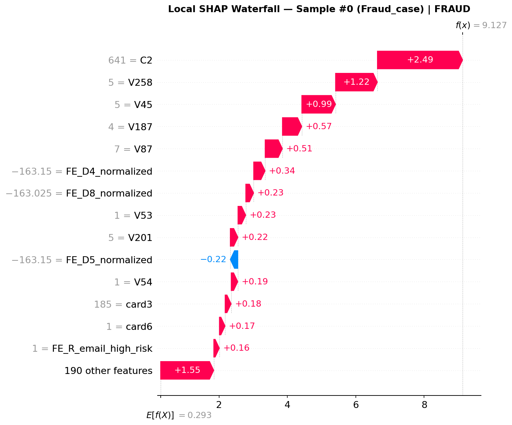

---

## 8. Local Explanation — High-Risk Fraud (idx 851)

Second fraud case analyzed — highest-risk fraud identified in the final run.

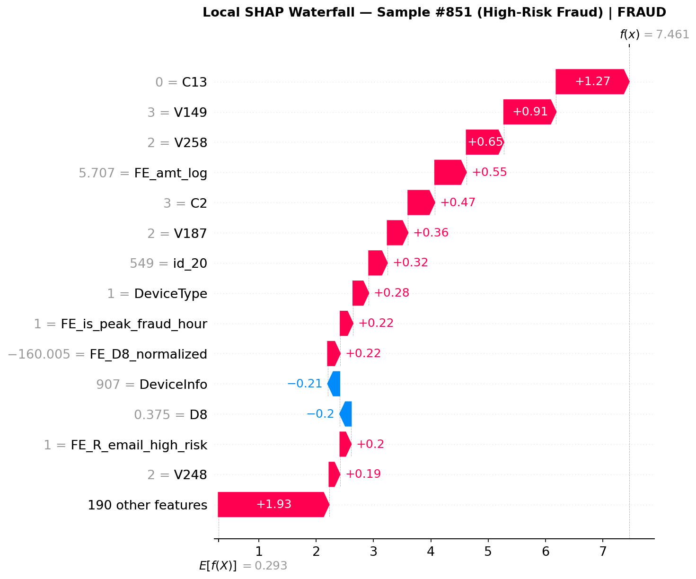

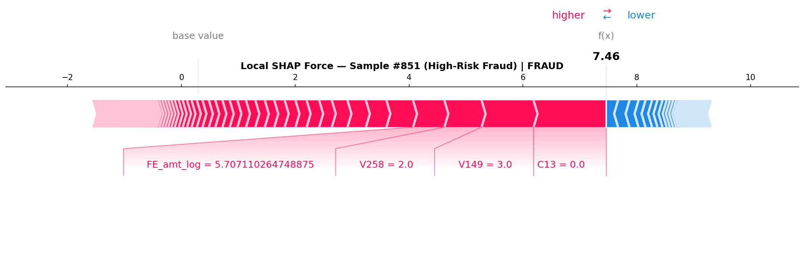

---

## 9. Local Explanation — Clear Legitimate Transaction

A transaction the model is highly confident is legitimate — SHAP values push strongly away from fraud.

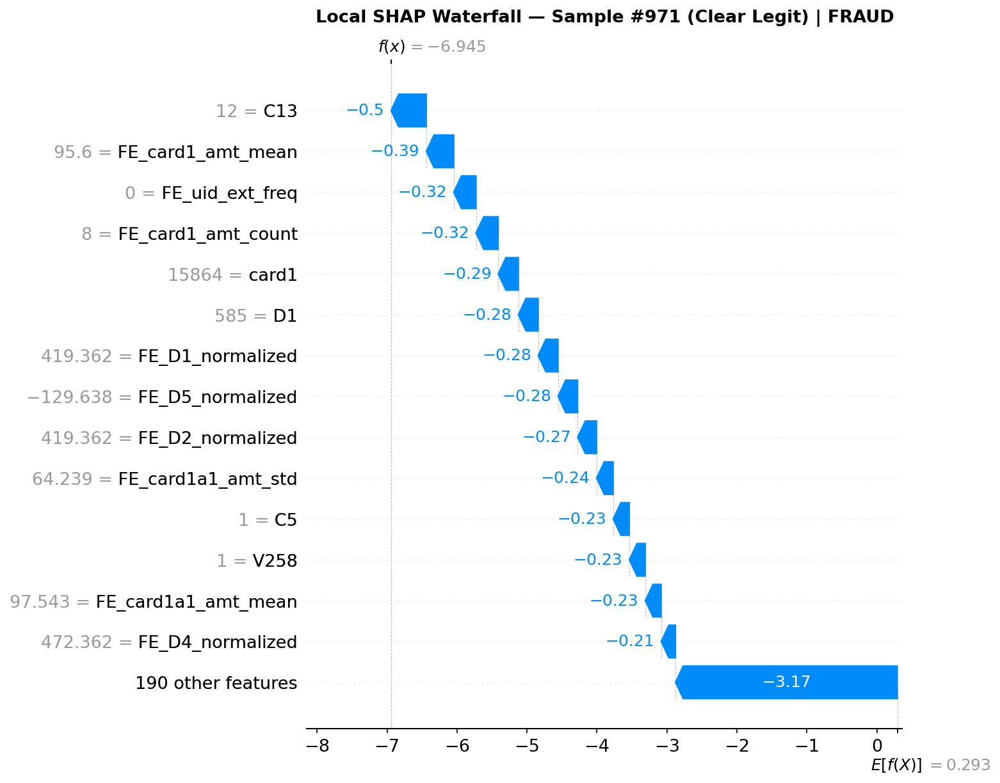

---

## 10. Dependence Plots — Top 3 Features

How SHAP value changes as feature value changes. Interaction coloring reveals which second feature modifies the effect.

**Top 3 features by mean |SHAP|:** `C13`, `C2`, `V258`

### C13 (interaction: C2)
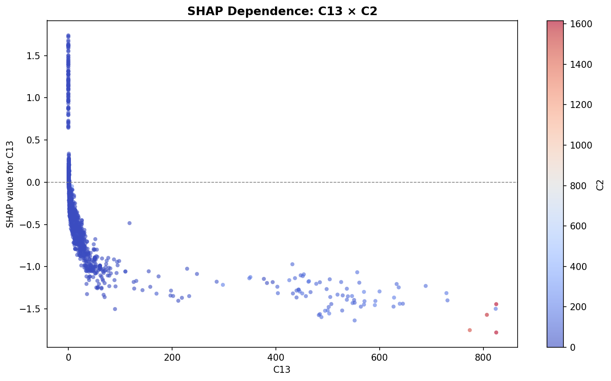

### C2 (interaction: V258)
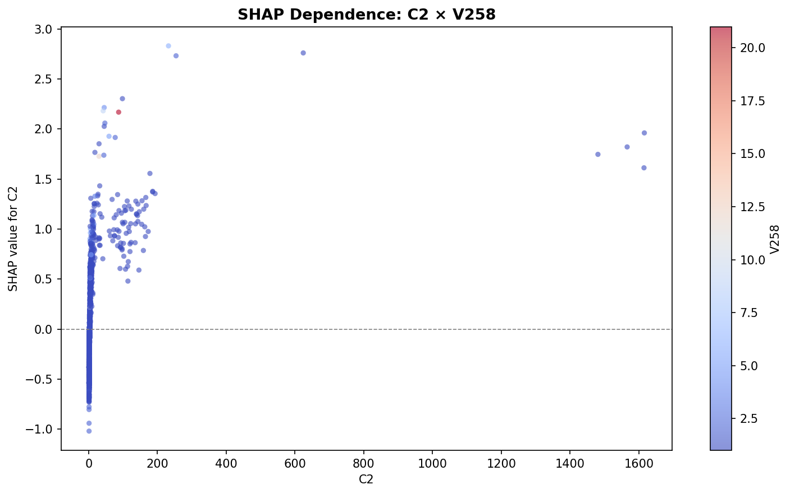

### V258
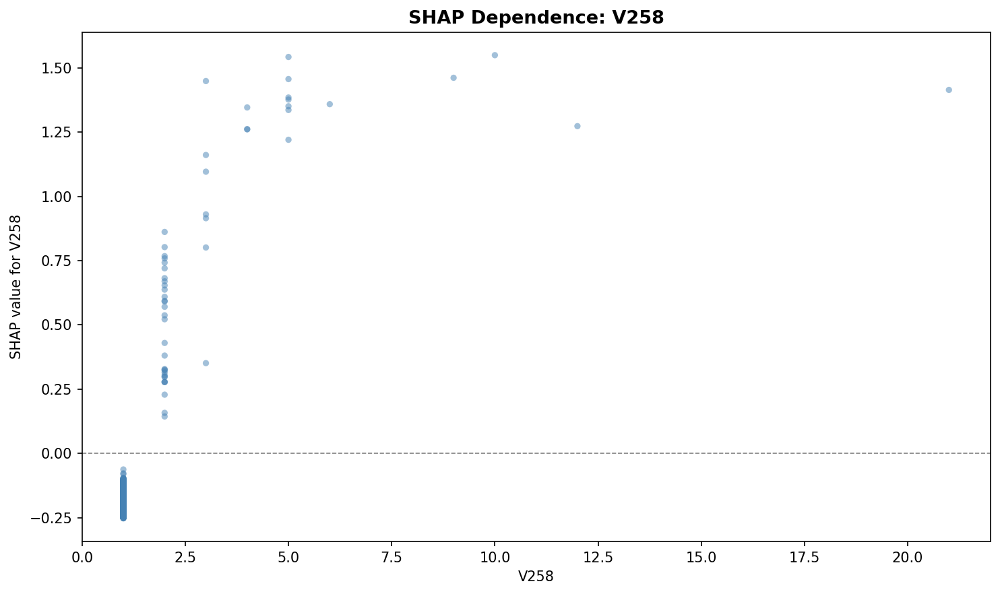

---

## Summary

| Finding | Detail |
|---|---|
| Base value | 0.2931 (avg fraud probability) |
| FE contribution | **34.4%** of total SHAP weight |
| Raw contribution | 65.6% of total SHAP weight |
| D_normalized in top fraud case | FE_D4, FE_D8, FE_D5 all in top 10 |
| Top global features | C13, C2, V258 (Vesta proprietary) |
| NaN flags confirmed | D6_isnan, D2_isnan in top 30 globally |

---

[← Model Analysis](07_model_analysis.md) | [← Back to README](../../README.md)